# Vaultide · 知洄

> 将一次学习，变成可追溯、可反刍、可持续生长的知识资产。

Vaultide 是一个开源学习工作台。它把外部的 GitHub 项目、论文、专利与技术文章，以及你在 Obsidian 中已有的项目、笔记、会议记录和文稿，组织为**带来源证据的互动学习路径**。

<p align="center">
  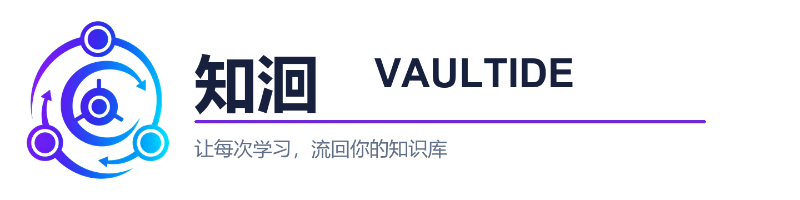
</p>

它不是只生成一份总结，而是形成一个完整闭环：

```text
选择学习对象 → 审查来源与证据 → 构建互动课堂 → 练习与阶段查点
→ 沉淀学习记录 → 归纳知识关系 → 回到 Obsidian 反刍复习
```

<p align="center">
  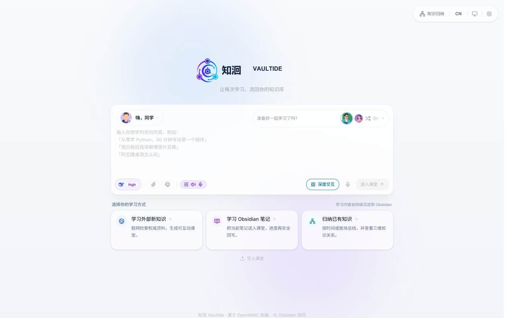
</p>

## 完整功能图册：每个核心环节都有真实界面

下面的图片全部来自 Vaultide 已实现的产品界面，而不是概念图。它们按照实际使用顺序展示从学习目标到知识复用的完整闭环。

### 1. 定义目标，并选择学习入口

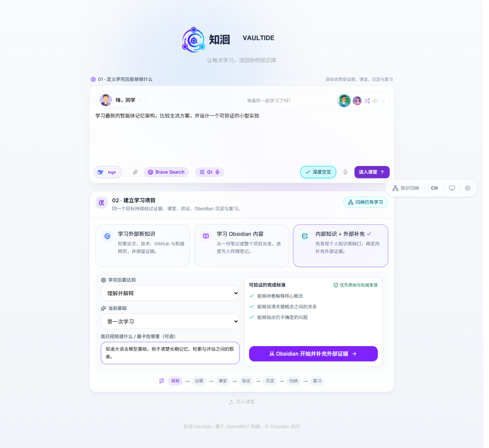

在同一个工作台写下要解决的问题，选择学习外部资料、Obsidian 内容，或以内外部资料共同学习；同时明确“学完能做什么”和可验证的完成标准。

### 2. 从外部问题开始检索与学习

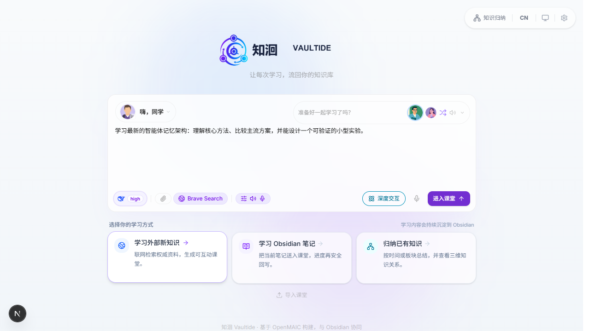

对 GitHub 项目、论文、专利和技术文章，可以直接从问题发起学习。外部资料会进入来源审查，而不是把未经核验的搜索结果直接当作结论。

### 3. 把 Obsidian 笔记或项目文件夹变成学习对象

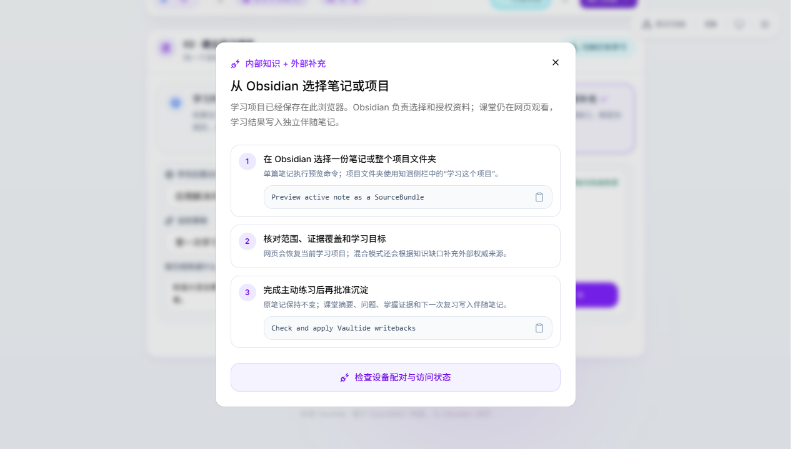

选择范围、确认来源与学习目标后再进入课堂。原始笔记不会被覆盖；后续写回需要经过网页与 Obsidian 的双重确认。

### 4. 清楚看见从网页学习到 Obsidian 写回的阶段

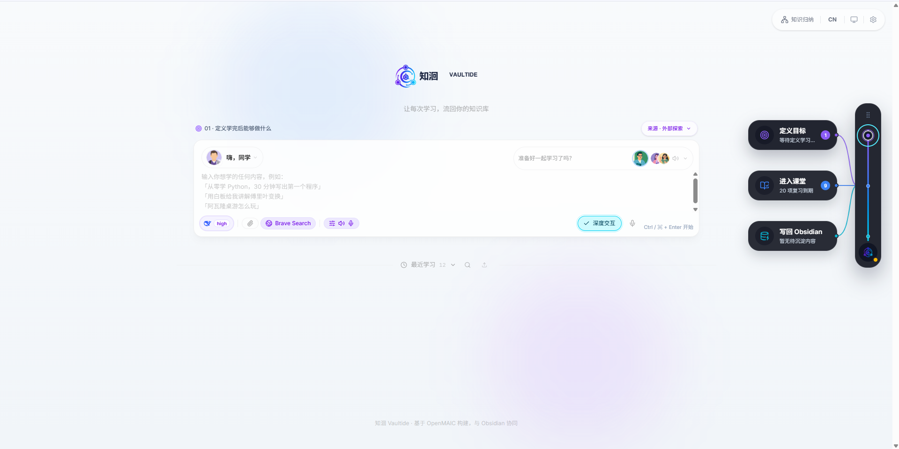

右侧阶段导航把整个过程显式化：当前在哪一步、已经建立多少课堂、哪些成果等待写回都一目了然。它连接网页端学习体验与 Obsidian 中的知识沉淀，而不是让用户在两个工具之间猜测状态。

### 5. 在互动课堂中理解、练习与完成迁移任务

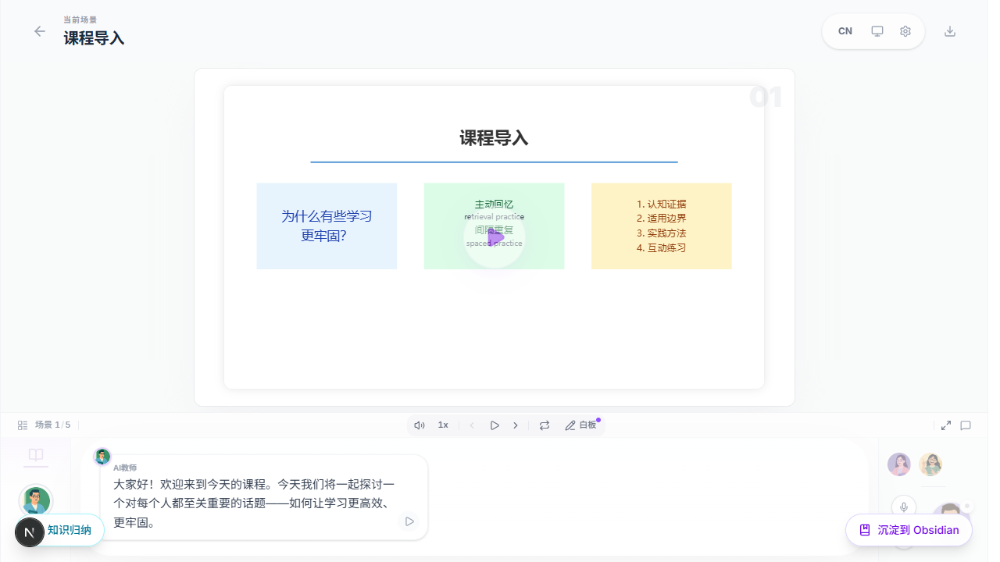

课堂不是静态幻灯片：它把概念、来源证据、讲解、阶段查点与最终“迁移到新问题”的任务放在同一条学习路径中。

### 6. 用主动练习把“看过”变成“会用”

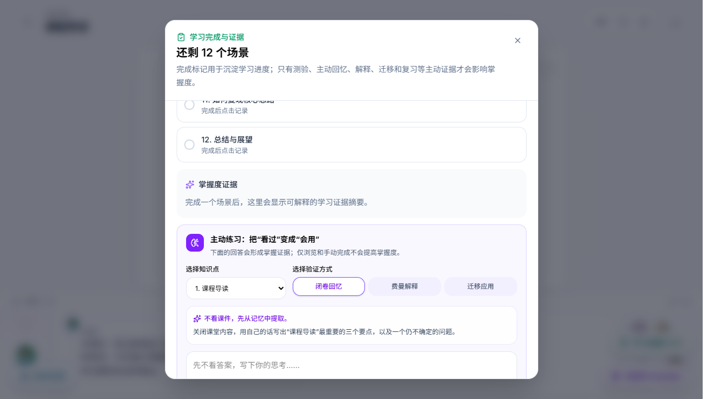

完成度不只由播放页数决定。主动回忆、费曼解释、迁移应用与复习任务会沉淀为掌握度证据，并驱动下一步学习建议。

### 7. 用遗忘曲线和薄弱点安排当天复习

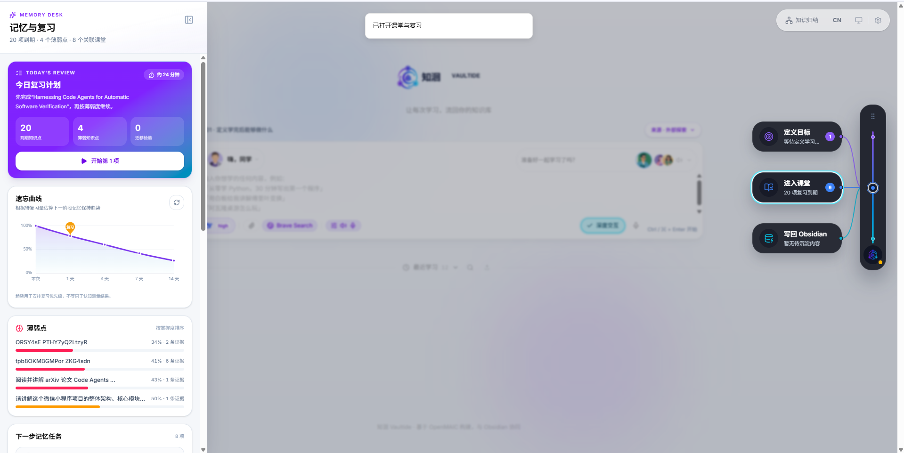

“记忆与复习”不只是一个课程列表。它汇总到期知识点、薄弱知识点、预计遗忘趋势与建议学习时长；遗忘曲线用于安排复习优先级，不冒充生理或认知测量结果。

### 8. 查看复习任务与学习系统健康状态

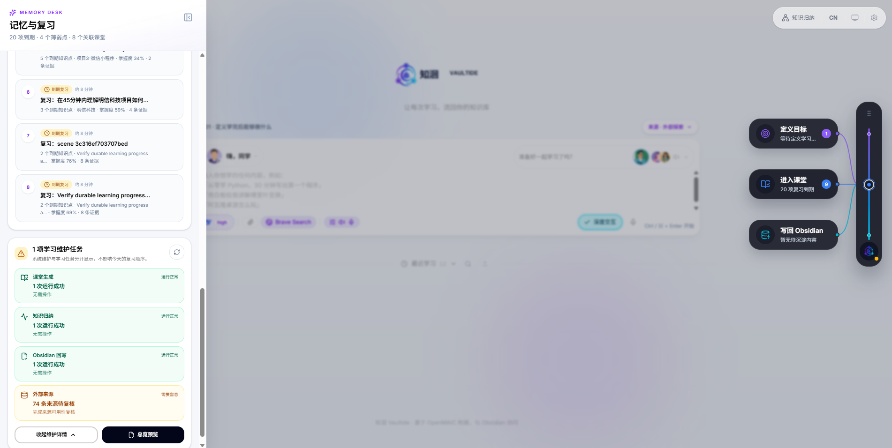

每项复习任务都保留关联知识点、掌握度和证据数量；课堂生成、知识归纳、Obsidian 回写及外部来源的状态也会分开呈现，避免一个问题掩盖整条学习链路。

### 9. 根据证据规划下一步学习与反刍

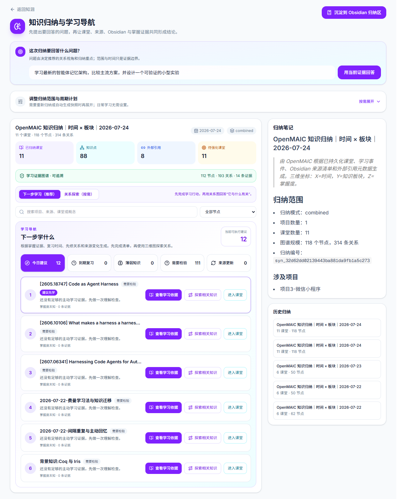

系统将已完成课堂、来源、学习事件与掌握度汇总为学习导航：哪些需要验证、哪些适合复习、哪些问题值得继续深挖，都可以从这里重新进入课堂。

### 10. 先生成学习记录预览，再决定是否沉淀

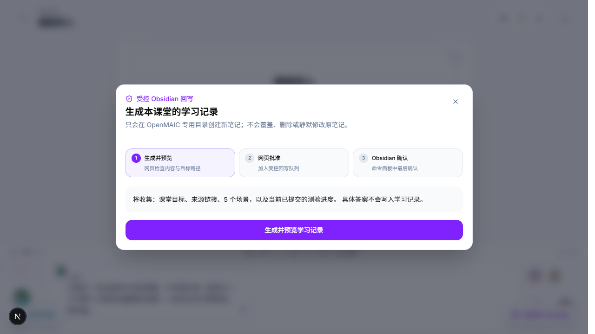

沉淀前会明确展示将收集哪些内容。学习记录与原始项目笔记分离，避免把答案、无关数据或未确认内容写入原文。

### 11. 通过网页批准与 Obsidian 确认完成受控回写


写回采用“预览 → 网页批准 → Obsidian 确认”的双端安全链路。课程目标、来源链接、阶段进度与学习证据进入独立 Vaultide 区域，原始资料保持可控。

### 12. 为项目设置周期性归纳计划

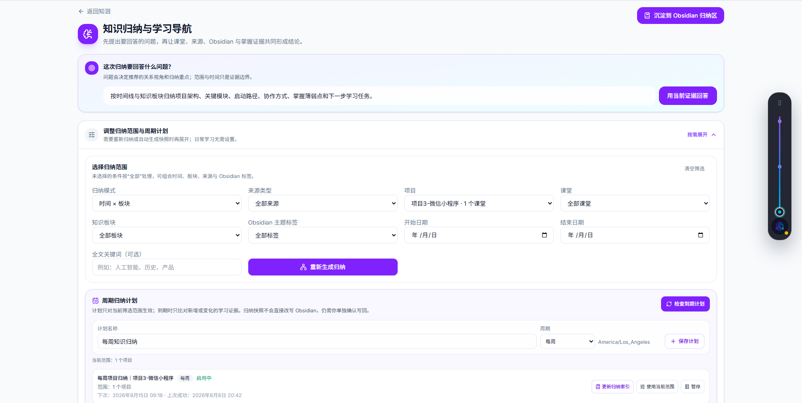

可以为一个项目设定每周归纳计划。计划只处理新增加或发生变化的学习证据；生成的归纳快照仍然遵循单独确认后才回写 Obsidian 的规则。

### 13. 保留可追溯的归纳快照与历史版本

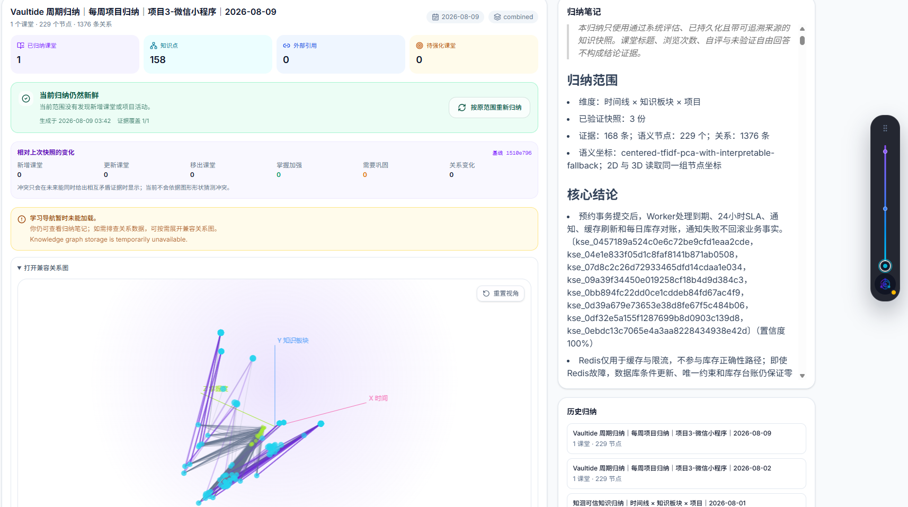

每次归纳都记录课程、知识点、关系、证据覆盖和历史版本。这样“知识归纳”不是覆盖式总结，而是可以按时间回看、比较和继续扩展的知识资产。

### 14. 按时间、来源、课程和知识板块重新生成归纳

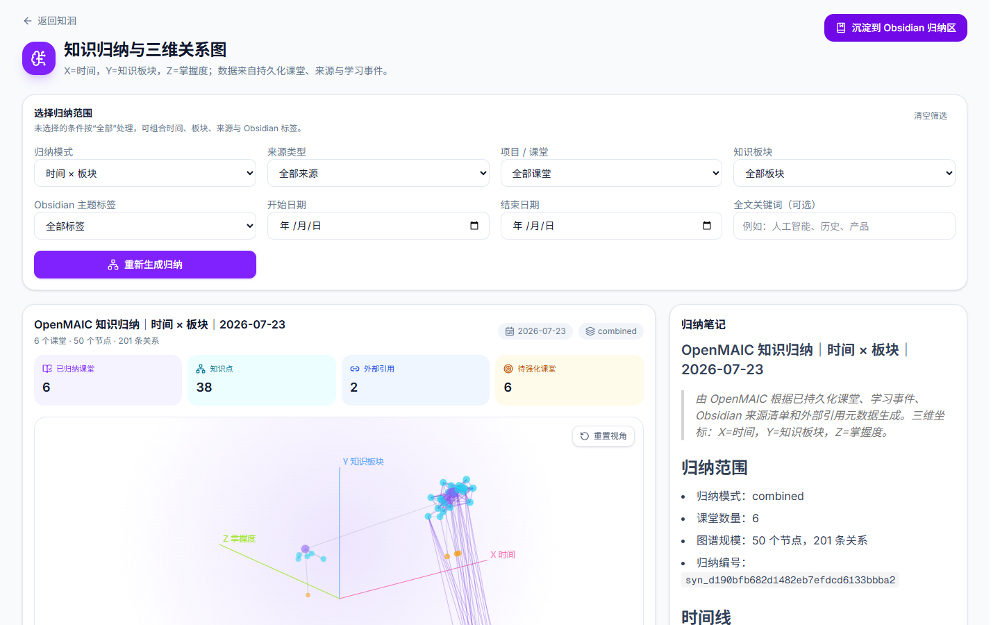

归纳不是一次性摘要。可以按时间、知识板块、来源、项目、课程和 Obsidian 标签筛选，重新生成面向当前问题的知识快照。

### 15. 在三维空间中看全局知识聚合

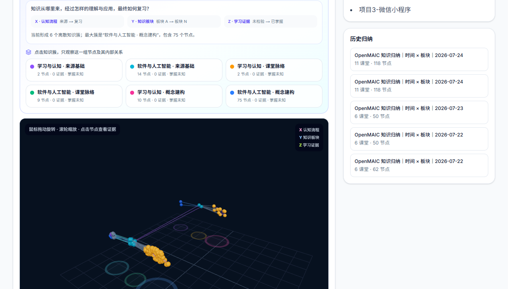

三维图把 X 轴知识流程、Y 轴知识板块、Z 轴学习证据放进同一空间；主题聚合与关系连线用于发现跨课程、跨来源的连接和空白。

### 16. 聚焦一个知识簇，追踪来源与学习证据

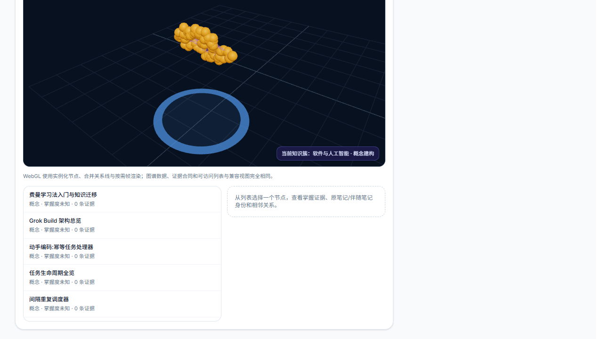

点击知识簇后可回到相关课堂、原始来源与伴随笔记。三维图的目标不是装饰，而是帮助你定位“我已经掌握了什么、证据在哪里、下一步该学什么”。

[](https://github.com/ZMS-PNG/Vaultide/releases/tag/v0.1.0-public-preview)

🎬 **产品宣传片（51 秒 / 静音版）**：[在线观看与下载](https://github.com/ZMS-PNG/Vaultide/releases/tag/v0.1.0-public-preview) · [直接下载 MP4](https://github.com/ZMS-PNG/Vaultide/releases/download/v0.1.0-public-preview/vaultide-learning-loop-silent.mp4) · 可编辑源工程位于 [`product/vaultide-multispace-video`](./product/vaultide-multispace-video)。

## 建立在 OpenMAIC × Obsidian 之上

- [**OpenMAIC**](https://github.com/THU-MAIC/OpenMAIC) 提供多智能体沉浸式学习的开源基础；Vaultide 在此基础上延展为面向长期学习的证据、质量、进度和知识沉淀工作流。
- [**Obsidian**](https://obsidian.md/) 是以本地 Markdown 笔记为核心的知识库工具；Vaultide 通过伴随笔记和审查式写回，让学习成果回到用户自己可掌控的知识库。

## Vaultide 能解决什么

### 外部知识：从“资料很多”到“真正学会”

对 GitHub 仓库、最新论文、专利或技术文章，Vaultide 会收集并冻结可审查的来源证据，再据此生成结构化课堂、实践任务、检查点与最终迁移任务。课程中的关键结论保留来源标签，便于回溯和核验。

### 内部知识：让 Obsidian 项目变成学习对象

选择一个 Obsidian 笔记或项目文件夹后，Vaultide 会在不改动原笔记的前提下，使用你授权的 Markdown 内容建立学习上下文。学习进度、伴随笔记、归纳结果和复习任务会写入独立的 Vaultide 区域，而不是覆盖原始资料。

### 归纳与反刍：让学习发生第二次、第三次

Vaultide 会记录学习证据、薄弱点、待复习任务与知识快照。你可以按项目、主题或时间线重新进入学习，并把新的理解与上一次沉淀关联起来。知识空间将离散知识点呈现为可探索的关系网络，帮助发现聚合、缺口与跨主题连接。

## 核心能力

- **证据驱动课程**：冻结来源集合、保留 `[S#]` 引用、优先使用原始和权威资料。
- **稳定的课程构建**：持久化计划、可恢复任务、有限重试、质量门禁与发布前检查。
- **真正的学习活动**：不止讲解，还包含诊断、检索练习、案例、决策、复盘与迁移任务。
- **学习进度闭环**：记录完成度、掌握证据、薄弱点、遗忘趋势和下一步复习。
- **Obsidian 伴随笔记**：原笔记保持不变；写回内容经审查后进入独立伴随笔记、归纳区和回写日志。
- **多维知识空间**：按主题、时间、掌握度和来源关系组织知识，而不只是单一目录。
- **隐私与控制**：只有你主动选择的本地内容才会进入学习上下文；密钥仅保存在服务端环境变量中。

## 两种入口，一个知识闭环

| 从哪里开始 | 适合什么 | 学习结果 |
| --- | --- | --- |
| Web | GitHub 项目、论文、专利、技术文章、未知领域 | 可审查的外部来源、课堂、实践与 Obsidian 沉淀 |
| Obsidian | 已有项目、笔记、会议、文稿与资料夹 | 基于已有上下文的课堂、进度回写、伴随笔记与复习任务 |

## 快速开始

1. 部署 Vaultide，并在服务端配置至少一个模型提供商和可选搜索服务。
2. 在 Obsidian 中安装 `packages/obsidian-plugin` 生成的插件，完成站点访问码与设备配对。
3. 在 Web 首页选择“学习外部新知识”或“学习 Obsidian 内容”。
4. 审查并确认来源，生成课堂；完成练习、阶段查点与最终迁移任务。
5. 在课堂中选择“沉淀”或“归纳”，在 Obsidian 的 Vaultide 区域审查并写入学习记录。

完整配置请参考 [`.env.example`](./.env.example)、[`packages/obsidian-plugin`](./packages/obsidian-plugin) 和 [Vercel 配置](./vercel.json)。

## 技术组成

- Next.js / TypeScript / React
- 结构化课程生成与互动场景渲染
- PostgreSQL / Neon 学习进度与工作流持久化
- Obsidian 插件：选材同步、伴随笔记、审查式写回
- Vercel 部署：受控 API 路由与运行时配置
- Vitest 质量回归与课程评估基准

## 开源与上游致谢

Vaultide 基于 [THU-MAIC/OpenMAIC](https://github.com/THU-MAIC/OpenMAIC) 演进，保留原项目的 MIT 许可证和署名。Vaultide 重点扩展了“来源证据 → 高质量课堂 → 进度与反刍 → Obsidian 沉淀 → 知识归纳”的长期学习工作流。

欢迎提出 Issue、分享你的学习流程，或参与贡献。

## License

[MIT](./LICENSE)
