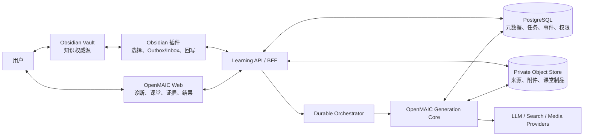
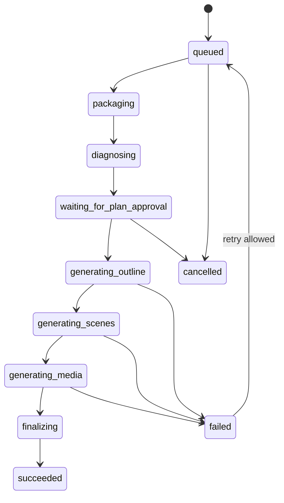

# OpenMAIC × Obsidian 完整架构文档

> 版本：v1.0 候选  
> 状态：Proposed  
> 架构目标：支持个人正式使用，同时为多设备、多模型、本地模式和未来多用户保留演进路径，避免因持久化、身份、同步和学习模型失控而进行大重构。

## 1. 架构摘要

采用以下总体架构：

> Obsidian 本地优先，Vault 掌握用户知识主权；OpenMAIC 负责学习体验与生成；云端负责授权、持久计算和可恢复任务；学习过程使用追加式事件；能力与复习状态由事件投影；云端只下发受限回写命令，永远不直接访问本地 Vault。

这里的“双向”是领域语义级交互：

```text
Vault → 明确选择的知识快照 → OpenMAIC
OpenMAIC → 学习结果/回写提案 → 用户确认 → Vault
```

它不是文件夹镜像，不替代 Obsidian Sync、Git、Syncthing 或 Dropbox。

## 2. 当前基线与必须先消除的风险

### 2.1 可复用基础

OpenMAIC 当前已有：

- 浏览器 IndexedDB/Dexie 本地持久化；
- 版本化 `@openmaic/dsl`、校验、标准化和迁移；
- `DocumentStore` 对课堂文档的抽象；
- `RuntimeStore` 对按学习者分区的会话和追加式记录的抽象；
- Browser、HTTP、PostgreSQL RuntimeStore；
- Markdown 文档提取；
- `.maic.zip` 离线课堂导入/导出；
- slide、quiz、interactive、PBL 和多智能体场景。

这些应成为扩展缝隙，而不是另造一套课堂格式和学习记录。

### 2.2 Vercel 生产风险

1. [classroom-storage.ts](../../lib/server/classroom-storage.ts) 把课堂和任务写入 `process.cwd()/data`。Vercel Functions 文件系统不可作为持久数据库。
2. [classroom-job-runner.ts](../../lib/server/classroom-job-runner.ts) 使用进程内 Map 去重；实例重启后状态消失。
3. [generate-classroom route](../../app/api/generate-classroom/route.ts) 使用 `after()` 运行长任务，无法提供跨崩溃和跨部署恢复保证。
4. 当前 `ACCESS_CODE` 是站点门禁，不具备设备身份、作用域、撤销、轮换和审计，不能成为插件 API 授权方案。
5. 当前默认 RuntimeStore 仍是浏览器 IndexedDB，个人多设备和服务端任务看不到统一学习账本。
6. 当前仓库 React/Next 版本落后于截至 2026-07-20 的官方安全补丁线；进入集成开发前必须升级并回归，具体目标版本以实施时官方公告为准。

因此，在实现 Obsidian 正式同步前，必须先完成依赖安全升级，并替换服务端磁盘、进程锁和非持久后台任务。

## 3. 架构原则

1. **Vault 主权**：原始笔记和附件以 Vault 为权威源。
2. **领域级同步**：同步 SourceSnapshot、LearningEvent、WritebackCommand 等对象，不同步整个文件夹。
3. **显式所有权**：每类数据只有一个权威写入方，其他端保存副本或投影。
4. **不可变输入**：运行中的生成固定引用知识包版本，不被后续笔记修改悄悄改变。
5. **事件事实**：学习行为追加记录；评分修正用新事件表达，不覆盖首答。
6. **投影可重建**：掌握度、复习队列和搜索索引都可以从事实数据重建。
7. **至少一次 + 幂等**：网络与队列承认重复投递，业务副作用必须幂等。
8. **人控写回**：模型只有提案权；插件执行有限命令；用户拥有最终写入权。
9. **端口隔离**：Vercel、Postgres、Blob、模型、Obsidian API 位于适配器层。
10. **版本先行**：协议、DSL、运行事件、算法、工作流和数据库迁移都显式版本化。
11. **单用户不等于无租户边界**：从第一天保留 owner/user/device/vault 维度。
12. **渐进复杂度**：P0 不引入 Redis、向量数据库、Queues、CRDT 或微服务，除非探针证明必要。

## 4. 质量属性优先级

| 优先级 | 属性 | 架构含义 |
|---|---|---|
| 1 | 数据安全与可逆 | 原文不静默覆盖、最小外发、可删除、可撤销 |
| 2 | 正确性与可追溯 | 来源版本、首答、项目证据和评分依据可追踪 |
| 3 | 可靠与可恢复 | 跨崩溃/部署恢复，重复请求无重复副作用 |
| 4 | 可演进 | 契约、迁移、供应商和上游 OpenMAIC 变化被隔离 |
| 5 | 学习有效性 | 系统能保存验证学习所需的事实，而非只保存内容 |
| 6 | 可用性与离线 | 插件断网可排队，课堂和记录可部分离线使用 |
| 7 | 成本与性能 | 有预算、并发上限和按步骤观测，不无界生成 |

## 5. 系统上下文



## 6. P0 部署拓扑

### 6.1 默认个人部署

| 能力 | 默认实现 | 备注 |
|---|---|---|
| Web/BFF | Next.js on Vercel | 延续当前部署 |
| 关系数据 | Vercel Marketplace 托管 PostgreSQL，建议 Neon | 标准 SQL/事务，避免供应商专有领域类型 |
| 大对象 | Vercel Private Blob | 来源、附件、课堂快照和媒体，不存业务权威状态 |
| 长任务 | Vercel Workflow 适配器 | 多步骤、重试、暂停和跨部署恢复 |
| 浏览器副本 | IndexedDB + 现有 BrowserDocument/RuntimeStore | 离线课堂与缓存，不作为云端权威 |
| 插件队列/缓存 | IndexedDB behind `LocalQueueStore` | `Plugin.saveData` 只保存小配置和游标 |
| 插件令牌 | Obsidian SecretStorage | 不进入 Vault、frontmatter 或普通 data.json |
| 向量检索 | P0 不需要 | 本地元数据/关键词/链接先召回 |
| Redis/Queues | P0 不需要 | 后续事件扇出再加入 |

Vercel Functions 的文件系统只读、`/tmp` 仅为临时空间；Blob 和 Postgres 是必要替代。[Vercel Runtime](https://vercel.com/docs/functions/runtimes) 大文件不能经过 4.5 MB 的普通 Function 请求体，应使用签发授权后的直接上传。[Functions 限制](https://vercel.com/docs/functions/limitations)

### 6.2 可替换端口

```ts
interface ObjectStore { /* put/get/delete/head/signedUpload */ }
interface JobOrchestrator { /* start/cancel/signal/getStatus */ }
interface ProjectRepository { /* project + blocker */ }
interface SourceRepository { /* bundle + snapshot metadata */ }
interface CourseRepository { /* versioned OpenMAIC document */ }
interface LearningEventStore { /* append/read/stream */ }
interface WritebackRepository { /* draft/command/receipt */ }
interface AuthContextProvider { /* web session / device principal */ }
interface ModelGateway { /* normalized model/search/media calls */ }
interface VaultGateway { /* plugin-only Vault operations */ }
interface Scheduler { /* review projection */ }
```

领域与应用层只依赖这些端口；Vercel Blob URL、Workflow Run ID 和数据库驱动对象不得成为领域字段。

## 7. 建议模块边界

```text
packages/@openmaic/learning-protocol
  纯 TypeScript 类型、JSON Schema、校验、迁移、错误码

lib/learning/domain
  Project、Sprint、Source、Evidence、Writeback、Review 规则

lib/learning/application
  用例：pairDevice、createSprint、startJob、appendEvent、approveWriteback

lib/learning/ports
  Repository、ObjectStore、JobOrchestrator、ModelGateway 等接口

lib/learning/adapters
  postgres、vercel-blob、vercel-workflow、openmaic-dsl、runtime-store

app/api/integrations/obsidian
  HTTP 边界、鉴权、速率限制、协议协商

integrations/obsidian
  UI、VaultGateway、LocalQueueStore、SourcePackager、WritebackExecutor
```

约束：

- `learning-protocol` 零 Next.js、React、Vercel、Obsidian 和数据库依赖；
- 插件可以依赖协议包，不能导入 Web 服务端实现；
- OpenMAIC 生成核心接收 SourceBundle 引用和规范化配置，不接收 Request/Response；
- UI 不直接操作数据库、Blob 或 Vault。

## 8. 数据权威与副本

| 数据 | 权威源 | 副本/投影 | 冲突规则 |
|---|---|---|---|
| 原始笔记/附件 | Vault | 用户授权的不可变云端快照 | Vault 优先，云端不能覆盖 |
| SourceBundle | 对象存储中的不可变制品 + DB manifest | 插件缓存 | 只创建新 revision |
| Project 结构化元数据 | 云端 Project 聚合；Vault 项目笔记为人类可读镜像 | 插件/Web | revision 乐观锁；冲突需用户选择 |
| OpenMAIC 课堂 | 云端 CourseRepository | 浏览器 IndexedDB、`.maic.zip` 导出 | 版本化修订，不原地无版本覆盖 |
| 学习事件 | 云端追加账本；断网时插件/浏览器 Outbox 是待提交事实 | 本地副本 | 按 eventId 并集，服务端分配顺序 |
| 能力/掌握视图 | 无独立事实权威 | 由学习事件投影 | 删除后可重建 |
| 复习状态 | ReviewEvent 事实 + Scheduler 投影 | Vault 任务镜像 | 算法版本化，可重算 |
| WritebackDraft/Command | 云端创建 | 插件 Inbox | baseHash + 幂等 receipt |
| 最终 Vault 写入 | Vault | 云端 receipt/审计 | 以执行结果哈希确认 |
| Token/模型 Key | SecretStorage/服务端密钥系统 | 无普通副本 | 不进入同步 |

## 9. 身份、稳定 ID 与版本

### 9.1 领域 ID

新领域对象使用带类型前缀的 UUIDv7，例如：

```text
usr_<uuidv7>
dev_<uuidv7>
vlt_<uuidv7>
prj_<uuidv7>
srcb_<uuidv7>
src_<uuidv7>
spr_<uuidv7>
job_<uuidv7>
evt_<uuidv7>
wbk_<uuidv7>
rev_<uuidv7>
```

UUIDv7 已在 RFC 9562 标准化，具备时间有序性。[RFC 9562](https://www.rfc-editor.org/rfc/rfc9562)

现有 OpenMAIC `stageId/sceneId/action` ID 继续视为稳定、不透明字符串，不为了统一格式立即重写；新 `courseId` 可以映射现有 stage。禁止用文件路径、标题、内容哈希、Blob URL、数据库自增 ID 或 Workflow Run ID 代替领域身份。

### 9.2 Note ID

Obsidian 没有天然不可变文件 ID。P0 默认策略：

1. 插件为每个曾选中的文件生成 `noteId`；
2. 映射保存在受管 sidecar manifest；
3. 监听 rename 更新 path alias，`noteId` 不变；
4. 用户可选择把 ID 写入 `openmaic.id` frontmatter，但不是默认要求；
5. sidecar 丢失时通过旧路径、内容哈希、标题和确认流程恢复，不能静默把不同笔记合并。

### 9.3 版本信封

所有跨端/持久对象至少包含：

```ts
interface VersionEnvelope {
  schemaVersion: number;
  producerVersion: string;
  minReaderVersion?: string;
  revision?: number;
  createdAt: string;
}
```

课堂保留 `dslVersion`；学习运行保留 `runtimeDslVersion`；能力/复习投影增加 `algorithmVersion`；工作流增加 `workflowVersion`。迁移是连续 `N → N+1` 的纯函数或数据库脚本，禁止在 UI 中散布临时兼容分支。

## 10. 知识选择与 SourceBundle

### 10.1 选择边界

P0 支持当前文件、当前选区、明确文件列表和白名单目录；默认不递归内部链接。P1 可允许用户选择 0–2 层链接深度。

默认排除：

- `.obsidian` 和插件配置；
- `OpenMAIC/_system`、生成记录目录和缓存；
- 隐藏文件；
- 用户排除规则；
- 带 `openmaic_sync: false` 的文件；
- 未经选择的附件和嵌入目标。

### 10.2 本地打包

插件步骤：

1. 用 MetadataCache 召回候选；
2. 用户确认具体范围；
3. 读取当前内容并计算 SHA-256；
4. 提取标题、块、链接、frontmatter 白名单和附件引用；
5. 规范化换行和路径，但保留原文定位信息；
6. 打包后再次检查 mtime/hash；发生变化则重新确认；
7. 生成 manifestHash 和权限摘要；
8. 小包经 API，大包/附件经签名授权直传 Private Blob。

### 10.3 不可变知识包

一个生成任务固定引用：

```text
sourceBundleId + revision + manifestHash
```

Vault 后续修改只产生新 revision，不能改变正在运行或已完成冲刺的历史输入。哈希用于完整性和同一 owner 内去重，不进行跨用户公开去重，避免内容存在性侧信道。

### 10.4 引用锚点恢复

CitationAnchor 保存：

- noteId、捕获路径、source revision；
- heading path 或 Obsidian block ID；
- 起止偏移和段落文本哈希；
- 最短必要 quote；
- 当前 Vault 解析状态。

打开引用时先按 noteId 找当前路径，再按 block/heading，最后用文本哈希模糊恢复；若无法唯一定位，打开文件并标记“历史快照引用”，不伪造精确位置。

## 11. 持久任务与课堂生成

### 11.1 业务 Job 与平台 Run 分离

API 必须先事务性创建 `jobId` 和数据库状态，再启动 Workflow。`platformRunId` 只是适配器元数据。

建议状态机：



### 11.2 步骤契约

每一步有：

- `stepKey`、`workflowVersion`、输入哈希；
- 尝试次数、开始/完成时间；
- retry classification；
- 模型/provider/prompt version；
- token、费用和 provider requestId；
- 小型结构化结果或对象存储引用；
- 幂等副作用键。

步骤先保存结果，再标记完成。重复执行时先查相同 `stepKey + inputHash` 的已完成结果。

### 11.3 重试分类

自动重试：429、暂时 5xx、网络超时、租约中断。  
不自动重试：协议校验、权限、内容过大、来源删除、明确的模型安全拒绝。  
不确定结果：模型已可能收费但响应未保存，标记 `outcome_uncertain`，优先用 provider requestId 对账或请求用户决定。

### 11.4 并发与取消

- 场景可有限并发，默认上限 2–3；
- 媒体生成独立预算和开关；
- 取消是持久状态，后续步骤开始前检查；
- 已完成不可逆外部调用不会假装被撤销，但其结果可不进入最终课堂；
- SSE/实时 UI 只是 DB 状态投影，断线后用 jobId/cursor 恢复。

### 11.5 OpenMAIC 契约复用

- 课堂仍使用 `@openmaic/dsl` Stage/Scene/Action；
- CourseRepository 负责 DSL 版本迁移和校验；
- 现有 `.maic.zip` 作为离线快照和恢复出口；
- SourceBundle、Sprint 和 Evidence 位于课堂 DSL 外层，不污染通用渲染契约；
- interactive/PBL 的应用扩展继续由 app-specific Scene union 承载。

## 12. 同步协议

### 12.1 Outbox/Inbox

插件和 Web 客户端采用相同模式：

1. 本地动作先持久化到 Outbox；
2. 联网后按设备序号批量推送；
3. 服务端用 `messageId/idempotencyKey` 去重；
4. 服务端分配 `ingestSeq` 并返回 ack 与不透明 cursor；
5. 客户端从 cursor 拉取变化；
6. 变化先落 Inbox，再执行；
7. 执行成功后发送 receipt；
8. 收到 receipt 后才清理可重放本地状态。

投递语义明确为：**至少一次传输，业务效果幂等**。客户端时间只用于展示，权威顺序使用服务端 ingestSeq 和会话 seq。

### 12.2 消息信封

```ts
interface SyncMessage<T> {
  messageId: string;
  deviceId: string;
  deviceSeq: number;
  entityType: string;
  entityId: string;
  baseRevision?: number;
  schemaVersion: number;
  occurredAt: string;
  payloadHash: string;
  causationId?: string;
  correlationId: string;
  payload: T;
}
```

### 12.3 P0 同步范围

上行：SourceBundle manifest、任务创建、LearningEvent、证据元数据、writeback receipt。  
下行：任务状态、课堂地址、WritebackCommand、ReviewItem 和服务端错误。  
P0 不同步任意文件变更，也不暴露通用文件 CRUD API。

## 13. 受控回写

### 13.1 允许的命令

P0：

- `createManagedFile`
- `appendManagedLearningJournal`

P1 才考虑：

- `upsertManagedFrontmatterFields`
- `replaceManagedBlock`
- `proposeCoursePatch`

绝不提供 `overwriteArbitraryFile`、任意路径删除或执行命令。

### 13.2 执行算法

```text
Inbox 持久化命令
→ 校验 owner/device/vault/path policy
→ 展示 diff 并取得用户确认
→ 记录本地 execution intent
→ 检查 baseHash/revision
→ Vault.process / processFrontMatter
→ 重新读取并校验 expectedResultHash
→ 写本地 operation log
→ 发送 receipt
```

如果插件在写入后、发送 receipt 前崩溃，重放时通过 `expectedResultHash` 和本地 intent 判断已执行，不能重复插入。

### 13.3 冲突规则

- 用户正文默认不自动合并；
- 受管新文件路径冲突时生成冲突提案，不覆盖；
- 受管 block 只修改明确标记区域；
- frontmatter 只修改 `openmaic` 命名空间；
- baseHash 不一致时停止，生成三方差异或新文件；
- 删除先 tombstone/回收站，P0 不支持云端发起源文件删除；
- 插件自己的写入带 operationId，抑制事件循环。

不在 P0 引入全 Markdown CRDT。CRDT 与现有 Vault 同步工具叠加会显著增加冲突面；未来只可在 `MergeEngine` 后对插件受管文档局部引入。

## 14. 学习事件、能力投影与复习

### 14.1 事件事实

复用 RuntimeStore 的“session + append-only records + monotonic seq”语义，增加 app-owned kind：

- `diagnosticAttempt`
- `hintRequested`
- `activityAttempt`
- `quizAttempt`
- `projectEvidenceSubmitted`
- `evidenceEvaluated`
- `writebackApplied`
- `reviewAttempt`
- `sprintCompleted`

所有事件带 eventId、actor/device/session、project/sprint/stage/scene anchor、payload、来源、grader/model/prompt version。AI 重新评分产生新 evaluation event，不修改原始答案。

### 14.2 能力投影

投影按 LearningObjective/Concept 计算：

- recall evidence；
- explanation evidence；
- application evidence；
- delayed transfer evidence；
- evidence count、最近时间、置信等级；
- `computedThroughSeq` 和 `algorithmVersion`。

P0 使用离散状态和证据列表，不展示虚假精确分数。删除投影表后必须能从事件重建。

### 14.3 复习调度

Scheduler 是独立端口：

- P0 `FixedIntervalScheduler`：D1/D7/D30；
- P1 `FsrsScheduler`：使用成熟 FSRS 实现和真实 review rating；
- 调度状态与能力状态分开；
- 只有用户回忆评分或可验证测验推进记忆状态；
- 内容大幅变化时创建新 contentRevision，不盲目继承旧调度；
- 算法切换前模拟未来负担，避免瞬间产生大量到期项。

FSRS 适合原子、可重复检索的 ReviewItem，不直接调度整个项目或综合能力。[FSRS 官方仓库](https://github.com/open-spaced-repetition/free-spaced-repetition-scheduler)

## 15. 认证与授权

### 15.1 P0 个人桥接

- Web 仍可暂时由现有 ACCESS_CODE 保护页面；
- 在已通过 Web 门禁的设置页生成一次性配对码；
- 服务端签发高熵随机设备令牌，只保存哈希；
- 令牌绑定 owner、device、vaultBinding 和 scope；
- 可单设备撤销、轮换和过期；
- 插件通过 `Authorization: Bearer` 发送，使用 SecretStorage 保存；
- CORS 不是授权边界，所有 API 都独立校验 principal 和 owner。

### 15.2 长期身份

AuthContextProvider 预留 OIDC Web 会话以及原生应用 Authorization Code + PKCE/Device Flow。插件是 public client，不能内置 client secret。个人部署可限制只有一个账户，但应表现为租户策略而非共享口令。

### 15.3 授权矩阵

| Scope | 能力 |
|---|---|
| `sources:write` | 创建和删除本设备上传的 SourceBundle |
| `sprints:write` | 创建/取消学习冲刺 |
| `artifacts:read` | 读取本 owner 的课堂和结果 |
| `events:append` | 追加学习事件，不能修改历史 |
| `writebacks:read` | 拉取回写命令 |
| `writebacks:receipt` | 上报执行结果 |
| `device:self` | 查看/轮换当前设备，不可管理其他设备 |

数据库查询必须从服务端 principal 注入 owner 条件，不相信请求体中的 ownerId。

## 16. 安全与隐私架构

### 16.1 信任边界

```text
用户输入：不可信
Vault 笔记和附件：不可信数据
外部网页：不可信数据
模型输出：不可信数据
插件设备：经令牌认证但仍需逐请求授权
服务端领域规则：可信计算边界
Vault 最终写入：高风险副作用边界
```

### 16.2 提示注入

- 来源放入明确的数据容器，不与系统指令同级拼接；
- 模型看不到 Vault 写令牌、Blob 管理令牌和数据库凭据；
- Tool 参数通过 schema 校验、允许列表和 owner 校验；
- 写入、删除、网络抓取和代码执行需要确定性政策和必要的人为确认；
- Markdown/HTML、链接、图片和引用全部净化；
- 建直接/间接/多模态提示注入回归集；
- 引用支持性单独验证，不因“有引用”就通过。

OWASP 明确指出 RAG 不能完全解决提示注入，并建议最小权限、外部内容隔离和高风险动作人工确认。[OWASP LLM01](https://genai.owasp.org/llmrisk/llm01-prompt-injection/)

### 16.3 数据保护

- TLS 传输；Postgres/Blob 静态加密；
- 私有对象存储和短时签名 URL；
- 模型 Key 只在服务端密钥系统；
- 来源正文和完整 Prompt 不进入日志/trace；
- 默认 30 天来源保留期，可立即删除；
- 删除任务追踪数据库、Blob、缓存和派生索引；
- 只在同一 owner 内按哈希去重；
- 备份、导出和恢复操作有审计。

不能把云端模型处理称为端到端加密：模型处理时必须看到明文。长期提供三个模式：本地模式、短保留私有云处理、云端便利模式，并明确展示边界。

### 16.4 插件安全

- 不启动入站 localhost 服务；
- 不使用通用 Vault REST 接口；
- 网络只连用户配置的 OpenMAIC origin；首次和变更时确认；
- 禁止重定向到非允许 origin；
- 插件禁用后停止事件、定时器和网络；
- 无未经披露的遥测；诊断包由用户主动导出且脱敏。

## 17. 离线与多设备

### 17.1 P0 离线

- 插件离线可创建 Project 草稿、选源和打包；
- Outbox 在网络恢复后继续，不生成新逻辑 ID；
- 已下载课堂继续使用现有 IndexedDB；
- 学习事件本地先写，联网后幂等汇聚；
- 云端生成显示“等待联网”；
- 回写命令只有在插件在线并确认后执行。

### 17.2 多设备预留

层次从第一天保留：

```text
owner → device → vaultBinding → sourceBundle
```

不同设备不得默认共享 `deviceId`。未来通过登录后的 `mergeLearner` 或 owner 身份把匿名 RuntimeStore 记录合并。Vault 可能由 Obsidian Sync 自行跨设备同步，本系统只同步领域事件和绑定，不复制整个 Vault。

## 18. 可观测性与成本

### 18.1 关联

所有请求/任务/模型调用带：

```text
requestId → correlationId → jobId → sprintId → stageId → stepKey
```

设备请求另带 deviceId；日志中的实体 ID可保留，但正文、quote、token、Cookie、签名 URL 和完整 Prompt 必须脱敏。

### 18.2 指标

- API P50/P95/P99；
- Workflow 各步骤等待/执行/重试；
- 模型 provider、model、token、费用、429/5xx；
- SourceBundle 大小、上传中断、保留清理；
- DB 冲突、事务重试、连接占用；
- writeback pending/accepted/conflicted/failed；
- duplicate suppressed；
- citation coverage/correctness；
- 业务学习指标见 PRD。

### 18.3 用户可见性

任务页展示业务步骤而非平台内部日志；失败需给“重试、补资料、重新授权、取消”中的明确动作。用户可导出一份脱敏诊断报告。

### 18.4 成本控制

- 每个 Sprint 有预算上限；
- 计划、场景、媒体分别计费；
- 缓存只复用相同 owner、相同输入哈希和相同生成配置的安全结果；
- 场景并发有上限；
- 视频默认关，图片/TTS 按需；
- 达预算时降级模型/媒体或等待用户确认，不隐式超支。

## 19. 数据库与事务原则

- Postgres 保存结构化权威状态，Blob 只保存大对象；
- 外键、唯一约束和 check 约束表达不变量；
- 任何副作用先建立业务 ID 和幂等记录；
- Outbox 与业务写入同一事务；
- 更新可变聚合使用 `revision` 乐观锁；
- 追加事件按会话锁/唯一 `(sessionId, seq)` 保证顺序；
- 进程内 Map 只可做性能优化，不能作为正确性机制；
- Redis 将来只用于缓存、限流或短租约，不保存唯一事实；
- 多用户阶段可加入 RLS，但应用层 owner 条件和越权契约测试仍保留。

## 20. 迁移与演进

### 20.1 渐进迁移

1. 冻结 learning protocol、ID、权威矩阵和契约样本；
2. 实现 Postgres Course/Job/Event 与 Private Blob；
3. 把 `data/classrooms` 和 `data/classroom-jobs` 迁入新存储；
4. 把 `after()` 任务迁到 JobOrchestrator；
5. 接入 Obsidian 单向 SourceBundle；
6. 接入学习事件和能力投影；
7. 接入受管新文件回写；
8. 核心价值验证后再做增量同步、三方合并、FSRS、向量检索；
9. 最后才评估多用户、共享和局部 CRDT。

### 20.2 数据库发布

统一使用：

```text
expand 新结构
→ 双写
→ 回填和校验
→ 切换读取
→ 停止旧写入
→ 观察一个发布周期
→ contract 清理旧结构
```

旧 Workflow 按 workflowVersion 由旧处理器完成；协议服务端至少兼容当前和前一个插件版本。旧客户端遇到不可读 future schema 必须安全拒绝，不进行破坏性“猜测迁移”。

### 20.3 上游 OpenMAIC 同步

- 保留 `upstream/main`；
- 与 Obsidian 有关的变化集中在独立 package、领域模块和 adapters；
- 不重命名/搬迁大批上游目录；
- 上游 DSL 变化通过适配器和迁移样本吸收；
- 每次同步运行 OpenMAIC 原有测试、学习协议契约测试和黄金 E2E。

## 21. ADR 决策清单

| ADR | 决策 |
|---|---|
| ADR-001 | Vault 是用户原创知识权威源，云端只保存明确授权的快照 |
| ADR-002 | 同步领域对象和事件，不做完整文件夹镜像 |
| ADR-003 | 云端不直接访问 Vault，回写由插件确认并执行 |
| ADR-004 | 新实体使用稳定 UUIDv7；路径、标题、URL 不是身份 |
| ADR-005 | SourceBundle 和课堂修订不可变，变化产生新 revision |
| ADR-006 | Outbox/Inbox，至少一次传输，业务效果幂等 |
| ADR-007 | P0 使用所有权规则与受管文件，不引入全局 CRDT |
| ADR-008 | 学习事实追加记录，能力和复习为可重建投影 |
| ADR-009 | 能力模型与 FSRS 调度分离 |
| ADR-010 | Postgres 保存权威结构状态，Private Blob 保存大制品 |
| ADR-011 | Workflow/Queue/Redis 不是业务权威源 |
| ADR-012 | Vercel Workflow 位于 JobOrchestrator 适配器后 |
| ADR-013 | 昂贵模型调用前先分配 ID 并持久化输入和状态 |
| ADR-014 | 插件独立设备身份，不复用 ACCESS_CODE 或模型 Key |
| ADR-015 | 插件只做出站 HTTPS，不开放通用本地 Vault API |
| ADR-016 | 所有持久与传输对象显式版本化，迁移使用 expand/contract |
| ADR-017 | 从第一天保留 owner/device/vaultBinding 边界 |
| ADR-018 | 供应商 SDK 不进入领域和协议包 |
| ADR-019 | 无未披露客户端遥测，服务端日志不记录来源正文 |
| ADR-020 | P0 固定复习，数据兼容未来 FSRS，但不提前引入复杂调度 |

每个 ADR 正式化时必须记录背景、选择、拒绝方案、正负后果、负责人和复审触发条件。

## 22. 被拒绝的架构方案

| 方案 | 拒绝原因 |
|---|---|
| 插件直接读取整个 Vault 并持续上传 | 隐私、成本、提示注入和索引陈旧风险过高 |
| 把 Obsidian 目录挂载给 Vercel | 技术上不成立，破坏本地数据主权 |
| 云端直接调用本地通用 REST API 写 Vault | 扩大 Vault 攻击面、移动端和网络不可用 |
| 使用 ACCESS_CODE 作为插件永久凭据 | 无设备身份、作用域、轮换和审计 |
| 用 Vercel 本地文件保存课堂/任务 | Function 文件系统不持久 |
| `after()` + 内存 Map 做正式长任务 | 崩溃和部署后不可恢复，幂等不可靠 |
| 所有内容塞进 Postgres JSONB | 大文件、媒体、缓存和传输成本不合适 |
| 所有状态塞进 Blob JSON | 缺事务、查询、唯一约束和并发控制 |
| P0 引入微服务、Redis、Queue、向量 DB | 增加运维和故障面，尚无负载证据 |
| 全 Markdown CRDT | 与 Obsidian 既有同步叠加，复杂度远超 P0 需求 |
| 用 LLM 自动解决文件冲突 | 可能丢失知识且不可确定，不满足可逆性 |
| 用 FSRS 直接表示项目能力 | 记忆调度与复杂能力不是同一模型 |

## 23. 架构验收场景

正式开发前后必须持续验证：

1. 笔记改名后 noteId 不变，历史引用仍可解释。
2. 离线追加十次事件，联网后无重复事实。
3. 同一任务创建请求重试三次，只生成一个 Sprint 和一个 Course。
4. 生成中途重新部署，任务从最后完成步骤继续。
5. 回写等待期间用户修改目标，不发生静默覆盖。
6. 插件写入后崩溃，重启不会重复插入。
7. 旧插件遇到 future schema 安全拒绝。
8. 猜测其他 owner 的 ID 无法读取来源、课堂或回写。
9. 删除 SourceBundle 能追踪并按策略处理派生制品。
10. 更换 Blob、Postgres、模型或 Workflow 实现不修改领域模型。
11. 删除能力投影后可从事件重建。
12. 插件禁用后停止扫描、联网和后台执行。
13. 来源中的提示注入不能触发 Vault 写入或外部工具。
14. Blob 直传超过 4.5 MB 正常，普通 API 不承载正文大包。
15. 任务取消后没有新步骤开始，已完成调用的状态可解释。

## 24. 演进触发器

只有满足相应证据才引入新基础设施：

| 能力 | 触发器 |
|---|---|
| 向量索引 | 元数据/关键词/链接召回的相关率无法满足真实任务，且有可量化基线 |
| Queues | 存在多个独立消费者或事件扇出，Workflow 不再合适 |
| Redis | DB/进程内缓存无法满足已测量延迟或限流需求 |
| FSRS | 用户稳定完成固定复习，且需要在工作量下优化保持率 |
| CRDT | 出现插件受管文档的真实多人实时共同编辑需求 |
| 微服务 | 单体边界产生可测的独立扩缩、发布或故障隔离需求 |
| 多租户/RLS 强化 | 出现第二个真实用户或共享课程 |
| 本地网关 | 用户有敏感数据不能进入云端，且愿意承担本地运行成本 |

只要这些触发器未出现，保持模块化单体是更可靠的选择。
