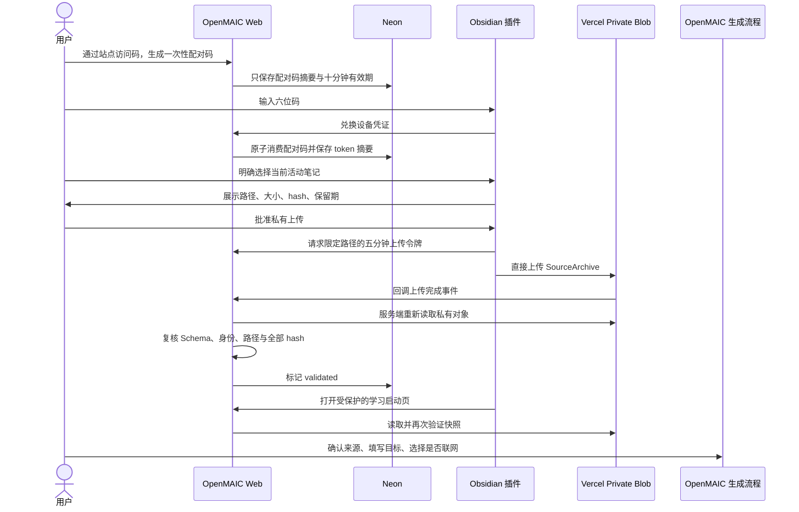

# M2 安全、验证与部署门禁

> 状态：`Production deployed / automated E2E passed / desktop acceptance pending`  
> 日期：2026-07-21  
> 范围：配对、私有来源上传、学习启动；不包括事件投影与 Vault 写回

## 1. 当前可交付纵向切片

## 2. 安全不变量

| 边界 | 必须保持的不变量 |
|---|---|
| 站点管理权限 | privileged learning route 在 handler 内验证 HttpOnly access cookie；middleware 不是唯一防线 |
| 配对 | 六位码短期、单次使用；明文不落库；兑换同时受 deployment/network/device 限流 |
| 设备凭证 | access 15 分钟、refresh 30 天且每次旋转；数据库只存摘要；disconnect 尝试 revoke |
| Obsidian | 默认不扫描 Vault；只读取当前活动 Markdown；上传前必须显示范围并二次确认 |
| Blob | private、不可覆盖、固定 owner/vault/bundle pathname；签名五分钟；回调后服务端重新读取 |
| 完整性 | pathname、content type、byte size、schema、identity、manifest hash、正文 hash 全部一致才 accepted |
| 保留期 | 1–90 天；每日定时清理；失败可重试并保留审计状态 |
| Prompt injection | 所有来源均是不可信数据；来源内命令不得改变系统职责、工具权限或用户目标 |
| 学习页 | 只允许已通过站点认证的 owner 读取；React 文本渲染，不注入来源 HTML |
| 外部知识 | 默认关闭；由用户逐次 opt-in；不得悄悄与私有快照混合 |

## 3. 外部知识学习策略

M2 允许用户在启动课程时打开 OpenMAIC 现有 Web Search，但这只是“联网增强”，不是完整证据系统。高质量外部知识学习应继续满足：

1. 先记录问题、输出目标、允许的来源类型和时效要求。
2. 优先官方文档、标准、论文和原始数据；低可信来源只能作为线索。
3. 保存 URL、标题、获取时间、内容 hash 和支持的具体结论，而不是只保存 AI 摘要。
4. 将“来源事实”“模型推断”“用户决策”分开呈现。
5. 课程中要求主动回忆、对比、反例和项目产出，不能只做被动讲解。
6. 结论进入 Obsidian 前必须经过用户确认；原始笔记默认只读。

当前切片已经完成第 1、4、5 项的交互入口与来源隔离，但网页快照、逐结论引用和 provenance ledger 尚未实现，不能宣称已经达到最终形态。

## 4. 部署必需配置

| 配置 | 作用 | 要求 |
|---|---|---|
| `DATABASE_URL` | Neon Postgres | Vercel Marketplace 注入；迁移前验证连接 |
| `BLOB_READ_WRITE_TOKEN` | Private Blob | 固定地域；只在服务端使用 |
| `LEARNING_OWNER_ID` | 单用户 owner | `own_` + 32 位小写十六进制，所有环境保持一致 |
| `LEARNING_OWNER_DISPLAY_NAME` | 可选显示名 | 不包含秘密 |
| `PAIRING_HMAC_SECRET` | 配对码/token/rate key 摘要 | 至少 32 字节随机值，各环境可独立 |
| `CRON_SECRET` | Vercel Cron 鉴权 | 至少 32 字节随机值 |
| `ACCESS_CODE` | 个人站点入口 | 高熵 passphrase；不与其他账户密码复用 |

任何 secret 都不得写入 Git、构建日志、客户端 bundle、Obsidian `data.json` 或文档示例。

## 5. 在线与专项验收矩阵

| 场景 | 预期结果 | 当前证据 |
|---|---|---|
| 无访问 cookie 创建配对码 | `401 token_invalid` | Preview 与 Production 合成 E2E 均返回 401 |
| 错误/过期/复用配对码 | 拒绝且不签发凭证 | Production 单次码重放返回 401；错误与过期分支由集成测试覆盖 |
| 连续猜码 | deployment/network/device 任一限流触发 `429` | 持久限流专项测试通过；未对正式站点执行破坏性爆破 |
| refresh 重放 | 旧 refresh token 在旋转后失效 | Production 轮换成功，旧 refresh 与 revoke 后 refresh 均返回 401 |
| 插件未确认上传 | 不创建 Blob、不登记 bundle | 插件 8/8 tests 通过；真实桌面人工验收待执行 |
| Obsidian 跨域预检 | 只允许受信任应用来源，真实 POST 可继续 | `app://obsidian.md` 返回 204 及完整 CORS 头；不可信网页来源返回 403 |
| 篡改 pathname/MIME/manifest/正文 | callback 拒绝，新 Blob 删除，记录 rejected | 服务端集成与完整性测试通过；Production 使用含 `undefined` 可选字段的故障形态验证了 JSON round-trip 后的合法 archive 完整性往返 |
| 访问其他 owner/bundle | 不返回正文 | owner/device/vault 作用域专项测试通过；正式环境为单 owner |
| 私有快照启动课程 | 来源清单可核对，默认不联网，进入现有 generation flow | Production 私有来源读取与正文/manifest 往返通过；真实模型课程生成待桌面验收 |
| 来源中包含“忽略系统指令” | 仍只作为学习材料，不改变系统/用户目标 | prompt isolation 专项测试通过 |
| 删除 bundle | 仅本设备/Vault 所属 bundle 可删，Blob 与元数据进入 deleted | Production 删除返回 200，后续读取返回 404，Blob 回到 0 个对象/0B |
| 错误 cron secret | 拒绝；正确 Vercel Cron bearer 才清理过期资料 | Production 未授权返回 401，正确 bearer 返回 200，`deleted=0, failed=0` |

## 6. 部署状态与剩余退出标准

### 已完成

- 用户已接受 Neon 条款并确认 Blob 永久地域为 `hkg1`。
- Neon `neon-camel-basket` 与 Private Blob `openmaic-learning-private` 状态健康。
- `0001_identity_pairing.sql`、`0002_source_uploads.sql` 已应用，并通过 SHA 幂等复跑校验。
- 必需变量已覆盖 Development、Preview、Production；秘密值没有进入 Git、文档或 QA 输出。
- Preview 与 Production 已完成访问码、capabilities、配对、rotation、私有上传/读取、完整性往返、删除、revoke 与重放拒绝 E2E。
- Production `dpl_61VupZ9i5cGA4U3eWJrkozsvB37m` 为 `Ready`；正式入口和插件默认 server URL 均为 `https://openmaic-eight-eosin.vercel.app`。
- 真实 Obsidian 上传发现并修复 CORS 预检缺失；Production 已验证受信任来源 204、非信任来源 403，以及 POST 响应返回正确 CORS 边界。
- 第二次真实上传发现并修复 JSON 序列化前后的 manifest hash 差异；协议和插件均有回归测试，最新 Production 故障形态 E2E 已被服务端接受、读回并删除，`failure_code=null`。
- Production 已配置服务端托管的 DeepSeek V4 Pro；API Key 为 Sensitive 且仅作用于 Production，允许模型与默认模型均固定为 `deepseek-v4-pro`。真实模型调用待用户页面验收。
- 浏览器 CLI 曾回显访问码输入参数；访问码已在真实 Vault 使用前轮换并重新部署，最终值未打印。登录态 UI 验收改由用户手动完成。
- 最终 Production 无 error 级运行时日志、无 HTTP 500；合成资料均已清理，Blob 为 0 个对象、0B。

### 仍需用户参与的桌面验收

1. 在 Obsidian 中重新加载已侧载的 `OpenMAIC Learning Bridge`，使 hash 修复生效。
2. 选择一份确认不敏感的活动 Markdown，核对上传预览后再次批准私有上传。
3. 在学习启动页填写目标，并用用户已配置的模型提供方生成一次真实课程。
4. 验收后复核日志、Blob 与本地插件设置中没有正文或凭证明文。

用户已明确授权直接发布 Production，因此线上发布已完成；在上述真实桌面链路完成前，产品状态仍标记为 `desktop acceptance pending`，不宣称 LearningEvent、掌握度或 Vault 写回已经可用。

## 7. 后续架构演进

M3 应优先实现追加式 LearningEvent 与项目证据，不先做全文向量库。M4 再实现 WritebackDraft、diff、租约、幂等 receipt 与用户确认写回。只有当真实使用证明跨大量笔记召回是主要瓶颈时，才引入索引或向量检索；其访问控制必须继承 owner/vault/source 作用域，不能建立无边界的全 Vault 语义副本。
