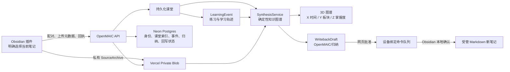

# OpenMAIC × Obsidian：学习、研究与知识归纳生产基线

> 状态：`Validated`  
> 基线日期：2026-07-21  
> 正式入口：`https://openmaic-eight-eosin.vercel.app`  
> 不可变部署：`dpl_FiWhKT1TEbJynV7LAmPisW3wC5HA`  
> Obsidian 插件：`openmaic-learning` v0.2.0

## 1. 本基线解决了什么

本批已经把最初的“来源上传纵向切片”扩展为三个可运行的学习闭环：

1. 用户授权一份 Obsidian 笔记，生成并持久化 OpenMAIC 课堂；课堂可以通过直接 URL 在不同浏览器会话中读取。
2. 课堂练习以追加式 LearningEvent 保存；用户可以预览学习记录，经网页批准后，再由 Obsidian 本地第二次确认并新建受管笔记。
3. 系统可以按时间、板块或二者组合，对持久化课堂、来源元数据、外部引用和学习事件进行确定性归纳，并显示三维知识关系图；归纳结果同样通过双确认写入 `OpenMAIC/归纳`。

外部研究链路已经完成限流、回退、引用和来源质量保护，但生产环境还没有配置独立的官方搜索 API 凭据。因此“稳定外部搜索”尚未激活，不能把 DeepSeek 的模型密钥当成搜索密钥使用。

## 2. 当前生产架构

关键边界：

- Blob 保存经用户明确授权的不可变来源快照和课堂快照；不使用 Vercel Function 临时文件系统承担持久化。
- Postgres 保存元数据、事件、引用溯源、归纳图和回写状态；不复制整个 Vault。
- 原始 Obsidian 笔记默认只读；当前回写操作只有 `createManagedNote`，且要求目标文件原先不存在。
- Web 端不能直接修改本地 Vault；插件只领取绑定到本设备与本 Vault 的已批准命令。

## 3. 数据与迁移状态

生产数据库已按顺序应用：

| 迁移 | 能力 |
|---|---|
| `0001_identity_pairing.sql` | owner、设备、Vault 绑定、一次性配对与令牌 |
| `0002_source_uploads.sql` | 私有来源上传、完整性状态与保留期 |
| `0003_classroom_snapshots.sql` | 课堂元数据与 Blob 快照索引 |
| `0004_learning_progress_writebacks.sql` | 学习冲刺、追加式事件、草稿、命令与回执 |
| `0005_research_provenance.sql` | 研究运行与引用来源元数据 |
| `0006_synthesis_knowledge_graph.sql` | 归纳运行、知识图谱和归纳回写上下文 |

`writeback_drafts_context_check` 强制每个草稿只能属于以下一种上下文：

- `learning-summary`：必须关联一个 sprint，不能关联 synthesis；
- `synthesis`：必须关联一个 synthesis，不能关联 sprint。

这避免了归纳回写被错误记成课堂事件，也避免一份草稿同时污染两条学习历史。

## 4. 外部研究基线

### 4.1 已实现

- Brave、Tavily、SearXNG 使用统一的结构化 provider error，不再把上游 HTML 错误页展示给用户。
- 429 会被归类为稳定的 `RATE_LIMITED`；仅在有意义时做短暂、有界重试，并根据配置尝试下一提供方。
- 搜索结果规范化 URL、移除跟踪参数、去重，并保守标记为 `primary`、`authoritative` 或 `general`。
- 给模型的材料和最终课堂保留 `[S1]` 一类引用编号；研究运行、提供方、抓取时间、策略和来源元数据写入 Postgres。
- 用户显式要求联网时，如果所有提供方失败，课堂生成会明确失败；不会静默退化为“看起来像研究过”的无引用课堂。

### 4.2 尚未激活

生产环境目前没有 `TAVILY_API_KEY`、`BRAVE_API_KEY` 或 `SEARXNG_BASE_URL`。公开 Brave 页面抓取会触发 429，只适合故障提示验证，不适合正式学习。

个人使用建议优先配置独立的 Tavily 官方 API key；配置后重新部署即可由现有弹性搜索链路接管。模型提供方密钥和搜索提供方密钥是两类不同凭据。

## 5. 三维知识图谱的可解释语义

图谱当前使用确定性规则生成，不让大模型自由发明节点或关系：

| 维度或元素 | 当前含义 | 证据来源 |
|---|---|---|
| X 轴 | 课堂创建时间 | 持久化课堂时间戳 |
| Y 轴 | 知识板块 | 课堂标题、描述、目标、场景标题、Obsidian 标题/标签的保守规则分类 |
| Z 轴 | 掌握度估算 | 优先使用练习 `earned / possible`；无评分时才按事件量做保守回退 |
| 课堂节点 | 一次持久化学习单元 | 课堂快照与 sprint |
| 概念节点 | 课堂内前 12 个有序场景 | 场景标题和顺序 |
| 外部来源节点 | 前 4 个研究引用 | `research_sources` 元数据 |
| Obsidian 来源节点 | 前 4 个授权快照 | SourceArchive 标题与标签，不使用整篇正文建图 |
| `contains` | 课堂包含场景 | 课堂结构 |
| `precedes` | 场景顺序或课堂时间推进 | 顺序与时间戳 |
| `cites` | 课堂引用外部来源 | 研究引用元数据 |
| `derived-from` | 课堂来自授权 Obsidian 来源 | SourceBundle 绑定 |
| `related` | 跨课堂标题/词元相似 | 可重算的中英文词元 Jaccard 相似度 |

当前图谱不是认知科学意义上的精确能力模型。页面和归纳笔记都应把 Z 轴理解为“有证据的估算”，而不是不可质疑的分数。未来可以增加 LLM 概念抽取或 embedding，但必须作为带版本的新投影器加入，不能替换原始事件、来源和确定性图谱事实。

## 6. 归纳与回写安全

- 归纳 API 要求站点管理员登录和当前协议版本。
- 单次最多读取最近 30 个持久化课堂，支持日期、板块关键词和课堂 ID 白名单筛选。
- 归纳保存 graph hash、节点数、边数、范围与生成时间；历史结果可重新读取。
- Markdown 包含时间线、板块、跨课堂连接、Mermaid 二维兼容图、待强化区域、引用和下一轮主动学习清单。
- Web 草稿目标固定在 `OpenMAIC/归纳`，只允许创建新文件。
- 网页批准只是把命令放入设备绑定队列；Obsidian 必须再次展示路径和内容并由用户确认。
- 本次部署验证使用临时 Vault 绑定完成了命令领取和回执，但没有写入 `D:\J-obsidian`。

## 7. 验证证据

| 门禁 | 结果 |
|---|---|
| 图谱、筛选、输入与服务专项 | 5 files，14/14 tests 通过 |
| Next.js 本地生产构建 | 通过；TypeScript、46 个静态页面和全部新增路由成功 |
| 整仓 Vitest | 332 files 通过、3 skipped；2969 tests 通过、4 skipped；3 个既有测试在高并发下超过统一 5 秒 |
| 超时文件单线程隔离复跑 | 3 files，49/49 tests 通过，无断言失败 |
| Vercel 远端生产构建 | Ready；46/46 静态页面生成，归纳页面与 3 个归纳路由存在 |
| 不可变部署全链路 QA | 配对、refresh rotation、私有上传、课堂、事件幂等、普通回写、归纳、历史、归纳回写、回执与清理全部通过 |
| 主域名浏览器验收 | `/knowledge` HTTP 200；标题正确；0 页面错误、0 console error、0 红色错误提示 |
| 数据库结构核验 | `synthesis_runs`、nullable 上下文列、FK 与 context check 均存在 |

正式主域名当前解析到不可变部署 `openmaic-b8mdxwvs1-zhaomaosen780-7874s-projects.vercel.app`，状态为 Ready。

## 8. 当前真实使用状态

自动 QA 创建的课堂、归纳、草稿、命令、回执、临时设备和 Blob 均已清理。正式 owner 当前没有可归纳的持久化课堂；旧课堂是在课堂持久化修复上线前生成，不能作为新图谱的可靠输入。

因此第一次真实使用应按以下顺序进行：

1. 在 Obsidian 按 `Ctrl+R` 重新加载一次，确保侧载的插件 v0.2.0 已运行。
2. 打开一份不敏感 Markdown 笔记，执行 `Preview active note as a SourceBundle`，核对后上传。
3. 在 OpenMAIC 来源页填写明确的学习目标，生成一个新课堂并完成至少一道练习。
4. 回到主页，点击右上角“知识归纳”，或直接访问 `/knowledge`。
5. 第一次先选择“时间 × 板块”，不填日期和关键词，点击“生成归纳”。
6. 检查三维节点和归纳 Markdown；若满意，点击“沉淀到 Obsidian 归纳区”。
7. 在网页预览并批准；回到 Obsidian 执行 `Check and apply OpenMAIC writebacks`，再次确认后才创建笔记。

若第 3 步勾选外部搜索，在官方搜索 key 配置前仍可能得到明确的 429/无可用搜索提供方提示；这是当前唯一阻挡“稳定外部知识学习”的部署配置项。

## 9. 下一阶段演进顺序

1. 配置官方搜索 key，完成一条带官方引用的真实外部知识课堂。
2. 用真实项目学习一周，校准 mastery 回退规则，避免事件数量被误读为能力。
3. 增加按项目、主题标签和来源类型的显式图谱筛选，不依赖关键词猜测全部语义。
4. 增加图谱版本与重建任务，使投影算法升级后可以重算而不改写原始事件。
5. 在有真实误分类样本后，再评估受约束的 LLM 概念抽取和 embedding 关系；所有模型生成边必须标记置信度和生成器版本。
6. 只有当“新建受管笔记”稳定使用后，才设计对现有笔记的 block 级补丁与三方合并，不提前开放任意覆盖。
