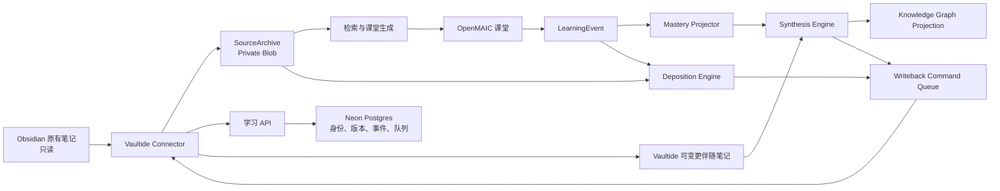

# 知洄 Vaultide 完整实现计划：学习、自动沉淀、进度回写与知识归纳

> 状态：`In progress`  
> 当前实现基线：Vaultide Web 与 Obsidian Connector `0.6.6`  
> 编制日期：2026-07-23  
> 关联专项：[三维知识图谱 v2 实现计划](./16-3D-KNOWLEDGE-GRAPH-V2-IMPLEMENTATION-PLAN.md)

## 实施记录

### 2026-07-24｜阶段 G7 增量图谱与周期归纳已完成

- 学习事件、来源版本、成功回写回执和归纳快照已经统一接入持久化图谱刷新队列。
- Web 与 Obsidian 设备事件都会局部重算 mastery；刷新只命中对应课堂/项目的最新归纳，不全量重建历史。
- 手动与周期归纳保存后自动生成 graph v2 投影；每日 Vercel Cron 负责运行到期计划和失败恢复。
- 迁移 `0020_knowledge_graph_refresh_queue.sql` 已应用，真实 Neon smoke 通过；32 个集成测试文件共 116 项通过，生产构建通过。

### 2026-07-23｜阶段 F 已完成，等待前端与插件正式发布

- 新增每日、每周、每月和自定义周期的归纳计划；每次运行都记录范围、证据清单、基线快照和增量差异。
- 同一计划的归纳快照保持不可变；每个计划只维护一个 `sdx_` 周期索引，写入 `Vaultide/归纳/周期/索引/`。
- 周期索引仅通过专用 `replaceSynthesisIndexBlocks` 协议更新受管区块，保留“我的补充”，并采用块级 CAS 拒绝冲突写入。
- 数据库迁移 `0017_synthesis_schedules.sql` 与 `0018_synthesis_indexes.sql` 已应用；协议、插件安全写回和归纳服务回归测试均已通过。

### 2026-07-23｜阶段 E 已实现并发布到候选版本

- 新增每个 Obsidian 项目唯一的 `pdx_` 项目学习索引，独立保存于 `Vaultide/系统/索引`；它从不覆盖项目内任何原始笔记。
- 项目索引汇总来源覆盖、待学习／学习中／待复习／已验证状态、来源版本更新提示、课堂与伴随笔记链接。
- 新增复习队列与完成事件；版本变化只显式提示“来源已更新”，不静默降低任何掌握度。
- 项目索引仅通过专用 `replaceProjectIndexBlocks` 协议更新受管块，保留“我的补充”自由编辑区，并以块级 CAS 拒绝冲突写入。
- 写回回执现在会令草稿进入 `applied`、`conflicted`、`failed`、`rejected` 或 `expired` 终态，成功写回后可安全生成下一次索引修订。
- 数据库迁移 `0016_project_learning_index_reviews.sql` 已应用；协议、插件和服务针对性测试均已通过。

## 1. 结论

### 当前实施进度（2026-07-24）

- 阶段 A 已完成：课堂完成快照、场景完成事件、主动学习证据、`mastery-evidence-v2` 和复习日期已落地。
- 阶段 B 已完成：原有笔记只读、稳定 `sou_` 身份、唯一 `cmp_` 伴随笔记、受管区块 CAS 与自由编辑区保护已落地。
- 阶段 C 核心闭环已完成：本地手动/批量/受管自动三种模式、启动与定时领取、离线回执 outbox、命令过滤和从命令到回执的沉淀审计链路已落地。
- 为降低第一次写入风险，当前“受管自动”只会更新已经人工创建并收到回执的伴随笔记受管区块；首次创建任何 Markdown 始终需要本地可见确认。这比允许后台首次建文件更严格。
- 阶段 D、E、F 和三维图谱 G1-G7 已按顺序落地；下一阶段是图谱 Worker/2,000 节点性能门和 G8 生产硬化。

下一阶段不再继续增加互不相连的入口，而是把现有能力收束成一个持续运行的个人学习系统：

```text
外部或 Obsidian 知识
→ 可追溯来源
→ OpenMAIC 课堂与主动学习
→ 学习事件和能力证据
→ 自动生成沉淀草稿
→ 更新 Vaultide 可变更笔记
→ 周期归纳和复习计划
→ 可解释的三维知识图谱
```

本计划以三个结果为完成标准：

1. 外部项目、论文、文章、技术和 GitHub 仓库完成学习后，能形成可追溯的 Obsidian 资料卡和学习记录。
2. 学习 Obsidian 内部项目或笔记时，原有笔记保持只读，新的进度持续更新到一份绑定的可变更笔记。
3. 用户可以按时间、板块、项目、来源和标签归纳，归纳结果进入专属目录，并同步生成可解释、可追溯的三维知识关系图。

## 2. 必须冻结的双笔记模型

每一份被学习的 Obsidian 原有笔记都对应两种完全不同的责任：

| 类型 | 权属 | 是否允许 Vaultide 修改 | 作用 |
|---|---|---:|---|
| 原有笔记 `Original Note` | 用户 | 否 | 保存用户原始材料、判断、文稿和事实 |
| 学习伴随笔记 `Learning Companion` | Vaultide 受管 | 是 | 保存摘要、知识点、问答、学习进度、掌握证据、归纳引用和复习计划 |

硬约束如下：

- 原有笔记无论位于 Vault 何处，始终按只读来源处理。
- Vaultide 不复制覆盖原有笔记，也不向原有笔记追加 AI 区块。
- 首次学习原有笔记时，创建一份稳定绑定的学习伴随笔记。
- 同一 Vault 中，一份原有笔记只能绑定一份有效伴随笔记。
- 后续学习同一原有笔记，只更新同一份伴随笔记，不反复产生不可识别的副本。
- 单笔记学习默认不再额外创建第三份“课堂学习记录”；每次课堂的时间、目标、活动和证据进入伴随笔记的受管学习历史区，完整事实保存在追加式 LearningEvent 中。
- 只有用户显式开启“导出每次学习快照”时，才创建独立、不可变的课堂记录文件。
- 伴随笔记必须位于 `Vaultide/` 受管根目录，具有稳定 `maic_note_id`、来源 ID、来源版本和内容哈希。
- 用户在伴随笔记中的自由编辑区必须保留；系统只能替换明确标记的 Vaultide 受管区块。
- 原有笔记被移动或重命名时，通过稳定来源 ID 重新建立链接，不以路径作为唯一身份。

项目学习索引、周期归纳和图谱快照属于跨多份来源的聚合资产，不是原有笔记副本，因此不违反“一份原有笔记＋一份可变更笔记”的一对一规则。

建议目录：

```text
Vaultide/
├─ 伴随笔记/
│  ├─ 项目名--项目ID/
│  └─ 独立笔记/
├─ 学习记录/
│  └─ 项目名--项目ID/
├─ 资料库/
│  ├─ 外部项目/
│  ├─ 论文与科研/
│  ├─ 技术与文章/
│  └─ 会议与文稿/
├─ 归纳/
│  ├─ 项目名--项目ID/
│  ├─ 主题/
│  └─ 周期/
├─ 复习/
└─ 系统/
   ├─ 索引/
   └─ 同步日志/
```

## 3. “自动”的产品定义

“自动沉淀”不能等同于“服务器可以任意改写 Vault”。产品提供三个本地可控级别：

| 模式 | 服务端行为 | Obsidian 行为 | 推荐用途 |
|---|---|---|---|
| 手动确认 | 生成草稿 | 每一份都预览并确认 | 初次使用、敏感项目 |
| 批量确认 | 自动生成低风险草稿 | 一次检查一批后应用 | 默认推荐模式 |
| 受管自动 | 自动生成并派发命令 | 本地按白名单自动更新受管笔记 | 个人长期稳定使用 |

受管自动模式只能执行：

- 更新 Vaultide 自己拥有的伴随笔记；
- 替换伴随笔记中的受管区块；
- 在预期哈希一致时进行幂等更新。

当前实现将首次创建 `Vaultide/` Markdown 视为必须人工确认的中等风险操作；之后同一伴随笔记的低风险受管区块替换才可进入受管自动。复习、索引和同步日志的自动范围将在对应资产模型与审计规则完成后逐项开放。

以下行为无论选择什么模式都必须人工确认：

- 修改 `Vaultide/` 之外的任何笔记；
- 删除、移动或重命名用户内容；
- 覆盖不存在稳定身份或内容哈希不一致的文件；
- 扩大上传范围；
- 把敏感原文发送给新的外部服务；
- 合并冲突内容。

## 4. 当前基线与差距

| 能力 | 当前状态 | 本计划目标 |
|---|---|---|
| Obsidian 单笔记和项目上传 | 已可用 | 增量、稳定身份和伴随笔记自动绑定 |
| 外部搜索与课堂 | 已可用，依赖正式搜索提供方 | 外部资料卡、来源版本和专用采集器 |
| 课堂持久化 | 已可用 | 纳入统一学习资产索引 |
| 学习事件 | 已有追加式事件，自动采集仍不完整 | 完整采集主动学习、测验、解释、迁移和复习证据 |
| 学习记录回写 | 可创建新笔记，双确认 | 支持可配置批量确认和受管区块更新 |
| 原有笔记保护 | 已只读 | 固化为双笔记协议不变量 |
| 知识归纳 | 已有确定性归纳 | 周期归纳、差异归纳、来源卡参与归纳 |
| 三维图谱 | 已有时间/板块/掌握度投影 | 语义概念、关系证据、图谱版本、WebGL 交互和增量重建 |
| 复习 | 文档和事件有预留 | 可执行的到期复习队列 |
| 自动运行 | 尚未形成完整闭环 | 事件驱动沉淀、插件拉取、周期任务和失败恢复 |

## 5. 目标用户流程

### 5.1 外部知识学习

```text
输入 URL、GitHub 仓库、论文标识或学习目标
→ 识别来源类型
→ 获取官方或高权威来源
→ 创建不可变来源版本
→ 生成资料卡草稿
→ 创建课堂并学习
→ 记录主动回忆、测验、解释和迁移证据
→ 课堂完成事件
→ 自动更新资料卡与学习记录
→ 创建复习项目
→ 纳入下一次知识归纳和三维图谱
```

外部资料卡至少包含：

- 标题、作者/组织、发布日期、抓取时间和规范 URL；
- 来源类型、版本、commit/DOI/arXiv ID 等稳定标识；
- 核心问题、关键概念、证据与引用；
- 用户学习目标；
- OpenMAIC 课堂链接；
- 已掌握、待验证和有争议的内容；
- 与现有项目、原有笔记和其他资料卡的关系；
- 下一次复习时间。

### 5.2 Obsidian 内部笔记学习

```text
用户明确选择原有笔记
→ 创建不可变来源快照
→ 查找或创建学习伴随笔记
→ 生成课堂
→ 记录学习事件
→ 更新伴随笔记中的受管区块
→ 保留用户自由编辑区
→ 原有笔记保持不变
```

学习伴随笔记建议结构：

```markdown
---
maic_note_id: companion-...
maic_source_id: sou_...
maic_source_version_id: sov_...
maic_original_path: ...
maic_managed: true
---

# 学习伴随笔记｜原笔记标题

> 原有笔记：[[原有笔记路径]]

<!-- vaultide:managed block=summary version=... hash=... -->
## 当前理解
...
<!-- /vaultide:managed -->

<!-- vaultide:managed block=concepts version=... hash=... -->
## 关键概念
...
<!-- /vaultide:managed -->

<!-- vaultide:managed block=progress version=... hash=... -->
## 学习进度与证据
...
<!-- /vaultide:managed -->

<!-- vaultide:managed block=history version=... hash=... -->
## 学习历史

- 2026-07-23｜课堂目标｜完成状态｜关键证据
<!-- /vaultide:managed -->

## 我的补充

此区域由用户自由编辑，Vaultide 不修改。
```

### 5.3 Obsidian 内部项目学习

一个项目文件夹对应：

- 一个稳定 `LearningProject`；
- 多个稳定 `LearningSource` 和版本；
- 每份原有笔记的一份学习伴随笔记；
- 一份项目学习索引；
- 多次 Learning Sprint；
- 一份可更新的项目能力与复习视图；
- 多次不可变归纳快照。

项目学习索引由 Vaultide 管理，展示：

- 当前项目版本和索引覆盖；
- 已学习、未学习、需要重新学习的来源；
- 当前卡点与学习目标；
- 最近课堂和学习证据；
- 当前掌握度与置信度；
- 待复习概念；
- 最近归纳和三维图入口。

### 5.4 周期与主题归纳

用户可以：

- 手动按时间、板块、项目、来源类型、课堂或标签生成归纳；
- 设置每日、每周或每月归纳；
- 仅归纳本周期变化；
- 对比两个归纳快照，查看新增、强化、遗忘和关系变化；
- 将归纳写入 `Vaultide/归纳/`；
- 由归纳自动生成复习和迁移任务。

## 6. 目标领域模型

现有 `Project → Source → Version → Chunk → RetrievalRun → Classroom → LearningEvent`
主链继续作为事实基础，新增以下可重算对象：

```text
LearningSource
├─ LearningSourceVersion
├─ LearningCompanion
│  └─ ManagedBlockVersion
├─ KnowledgeAsset
│  └─ KnowledgeAssetVersion
├─ LearningSprint
│  ├─ LearningEvent
│  └─ MasteryProjection
├─ DepositionRun
│  └─ DepositionItem
├─ ReviewItem
├─ SynthesisRun
└─ KnowledgeGraphProjection
```

### 6.1 新增对象

| 对象 | 作用 | 是否事实 |
|---|---|---:|
| `LearningCompanion` | 原有笔记与可变更伴随笔记的稳定绑定 | 是 |
| `ManagedBlockVersion` | 记录受管区块的版本、哈希和生成原因 | 是 |
| `KnowledgeAsset` | 外部资料卡、学习记录、伴随笔记等长期资产身份 | 是 |
| `KnowledgeAssetVersion` | 资产的不可变历史版本 | 是 |
| `DepositionRun` | 一次自动沉淀或批量沉淀运行 | 是 |
| `MasteryProjection` | 从事件计算的掌握度、置信度和证据摘要 | 否，可重算 |
| `ReviewItem` | 到期复习任务及其状态 | 是 |
| `KnowledgeGraphProjection` | 某范围和算法版本下的图谱快照 | 否，可重算 |

### 6.2 身份规则

- 原有笔记身份使用现有 `sou_`，不使用路径作为唯一 ID。
- 伴随笔记使用 `cmp_<32 hex>`。
- 知识资产使用 `kas_<32 hex>`。
- 沉淀运行使用 `dpr_<32 hex>`。
- 复习项目使用 `rvi_<32 hex>`。
- 图谱投影使用 `kgp_<32 hex>`。
- 所有记录必须包含 `owner_id`；项目级对象还必须包含 `project_id`。

## 7. 数据权威与更新规则

| 数据 | 权威来源 | 更新方式 |
|---|---|---|
| 原有笔记正文 | Obsidian | 用户编辑，Vaultide 只读 |
| 来源快照 | Private Blob | 用户授权后创建不可变版本 |
| 课堂 | 持久课堂快照 | 创建新 revision，不原地篡改历史 |
| 学习行为 | `learning_events` | 追加式 |
| 伴随笔记受管区块 | Vaultide + 本地回执 | 预期哈希的受控替换 |
| 用户自由编辑区 | Obsidian | Vaultide 永不修改 |
| 掌握度 | 投影器 | 从事件重算 |
| 知识图谱 | 投影器 | 从来源、课堂、事件和人工反馈重算 |
| 归纳笔记 | 不可变归纳快照 | 新建；索引页可受控更新 |

## 8. 目标架构



架构原则：

1. 来源事实、学习事件、能力投影和图谱投影必须分层。
2. 自动化由持久状态机驱动，不依赖一次 Vercel Function 长时间存活。
3. 插件是本地最终执行者；服务器不能直接访问 Vault 文件系统。
4. 所有写入都可幂等重放，并产生本地回执和可审计记录。
5. 图谱、掌握度和归纳可以升级算法并重建，历史事实不能被算法覆盖。

## 9. 回写协议 v2

现有 `createManagedNote` 保留兼容，新增两个严格命令：

### 9.1 `createCompanionNote`

前置条件：

- 目标位于 `Vaultide/`；
- `maic_note_id` 和 `maic_source_id` 唯一；
- 目标文件不存在；
- 原有笔记仅作为链接和来源身份，不被写入。

### 9.2 `replaceManagedBlocks`

只允许修改满足全部条件的笔记：

- 位于 `Vaultide/`；
- frontmatter 含 `maic_managed: true`；
- `maic_note_id` 与命令一致；
- 当前文件哈希或所有目标区块哈希与 `expectedHash` 一致；
- 只能替换成对出现的 `vaultide:managed` 区块；
- 不得触碰用户自由编辑区；
- 不得改变文件路径；
- 冲突时停止并创建差异预览。

沉淀目标解析必须遵循：

1. 单一 Obsidian 原有笔记：更新唯一伴随笔记；
2. Obsidian 项目：分别更新受影响来源的伴随笔记，并更新一份项目学习索引；
3. 单一外部来源：更新该来源唯一资料卡；
4. 多来源归纳：创建不可变归纳快照，并更新一份归纳索引；
5. 除非用户显式开启快照导出，不为每次课堂新建额外 Markdown。

命令必须带：

- `commandId`、`idempotencyKey`；
- `riskLevel`；
- `automationEligibility`；
- `expectedFileHash` 或受管区块哈希；
- `sourceVersionIds`；
- `generatorVersion`；
- `expiresAt`；
- `rollbackPayloadHash`。

## 10. 自动沉淀状态机

```text
pending
→ collecting
→ generated
→ policy_checked
→ queued
→ leased
→ locally_validated
→ applied
→ receipted
```

异常状态：

- `blocked_missing_source`
- `blocked_policy`
- `conflicted`
- `expired`
- `failed_retryable`
- `failed_terminal`
- `cancelled`

幂等键建议：

```text
ownerId + assetType + sourceVersionId + sprintId + projectorVersion
```

同一幂等键不得生成两份语义相同的伴随笔记或学习记录。

## 11. 掌握度和进度投影

当前“无测验时按事件数量估算”应升级为证据模型：

- 没有主动学习证据时显示“未知”，不显示伪精确低分；
- 被动浏览不增加掌握度；
- 主动回忆、解释、练习、迁移任务和延迟复习分别赋予不同权重；
- 查看答案和频繁提示降低证据独立性；
- 同一题重复作答不能无限累加；
- 掌握度和置信度分开显示；
- 保存投影器版本和证据数量；
- 任何分值都能展开查看“为什么”。

建议输出：

```ts
interface MasteryProjection {
  conceptId: string;
  estimate: number | null;
  confidence: number;
  evidenceCount: number;
  evidenceTypes: string[];
  lastPracticedAt?: string;
  nextReviewAt?: string;
  projectorVersion: 'mastery-evidence-v2';
}
```

## 12. API 规划

### 12.1 自动化与沉淀

- `GET /api/v1/deposition-policy`
- `PATCH /api/v1/deposition-policy`
- `POST /api/v1/deposition-runs`
- `GET /api/v1/deposition-runs/:runId`
- `POST /api/v1/deposition-runs/:runId/retry`
- `POST /api/v1/sprints/:sprintId/complete`

### 12.2 伴随笔记

- `POST /api/v1/companions/resolve`
- `GET /api/v1/companions/:companionId`
- `POST /api/v1/companions/:companionId/drafts`
- `GET /api/v1/companions/:companionId/history`

### 12.3 掌握与复习

- `GET /api/v1/mastery?projectId=&conceptId=`
- `POST /api/v1/mastery/rebuild`
- `GET /api/v1/reviews?state=due`
- `POST /api/v1/reviews/:reviewId/complete`

### 12.4 周期归纳

- `GET /api/v1/synthesis-schedules`
- `POST /api/v1/synthesis-schedules`
- `PATCH /api/v1/synthesis-schedules/:scheduleId`
- `POST /api/v1/synthesis-schedules/run-due`
- `GET /api/v1/syntheses/:synthesisId/diff/:baselineId`

所有变更接口继续要求站点管理员身份、协议版本、幂等键和 owner 范围。

## 13. 数据库迁移顺序

迁移必须保持追加式，不修改已应用迁移文件：

### `0011_learning_companions.sql`

- `learning_companions`
- `managed_block_versions`
- 原有来源与伴随笔记唯一绑定约束
- owner、vault 和 project 复合外键

### `0012_deposition_automation.sql`

- `deposition_policies`
- `deposition_runs`
- `deposition_items`
- 命令风险级别、自动化资格和幂等索引

### `0013_mastery_reviews.sql`

- `mastery_projections`
- `review_items`
- 投影版本和到期索引

### `0014_deposition_audit_links.sql`

- 为 `DepositionItem` 追加精确的 draft、command 与 receipt 链接
- 记录 `leased`、`locally_validated` 与 `receipted` 等可审计状态
- 不改写任何既有沉淀记录

### `0015_knowledge_assets.sql`

- `knowledge_assets`
- `knowledge_asset_versions`
- 外部资料卡与来源版本绑定

### `0017_synthesis_schedules.sql`

- `synthesis_schedules`
- `synthesis_schedule_runs`
- 周期和 scope hash 唯一约束

### `0018_synthesis_indexes.sql`

- `synthesis_indexes`
- 每个计划和 Vault 只有一个可变更索引，周期快照保持不可变
- `replaceSynthesisIndexBlocks` 的命令、草稿和本地写回安全约束

### `0019_knowledge_graph_v2.sql`

由三维图谱专项计划定义；必须晚于来源资产和掌握度投影。

## 14. 分阶段实施

### 阶段 A：学习事件和完成语义

目标：让系统知道“用户看过”和“用户真正完成学习”的区别。

工作项：

1. 补齐课堂开始、场景完成、测验提交、解释提交、提示、查看答案、迁移和复习事件。
2. 为每个客户端事件生成稳定 `clientEventId`，保证重试不重复计数。
3. 增加 `sprintCompleted` 完成快照。
4. 实现 `mastery-evidence-v2` 投影器。
5. 在课堂界面显示学习证据和待完成项。

Gate A：

- 重复加载和重试不增加事件；
- 被动浏览不增加掌握度；
- 完成课堂后能得到可解释的投影；
- 旧事件仍能读取。

### 阶段 B：双笔记与安全更新

目标：建立原有笔记只读、伴随笔记可持续更新的基础。

工作项：

1. 实现 `LearningCompanion` 身份和路径规划。
2. 实现 `createCompanionNote`。
3. 实现受管区块解析器和 `replaceManagedBlocks`。
4. 实现沉淀目标解析器，保证单笔记课堂更新唯一伴随笔记。
5. 插件显示原有笔记与伴随笔记的绑定关系。
6. 冲突时展示逐区块差异，不覆盖用户内容。
7. 为现有学习记录提供一次性迁移/绑定工具，但不自动改写旧文件。

Gate B：

- 原有笔记 SHA-256 在所有验收场景前后完全一致；
- 用户自由编辑区在更新后逐字节一致；
- 同一原有笔记重复学习十次仍只有一份有效伴随笔记；
- 默认模式下不会为十次课堂生成十份额外 Markdown；
- 路径移动后能通过 `sourceId` 找回伴随笔记；
- 哈希冲突时零写入。

### 阶段 C：自动沉淀策略

目标：完成手动、批量和受管自动三种模式。

工作项：

1. 服务端实现沉淀状态机和策略。
2. 插件增加“同步与自动化”设置页。
3. 本地保存自动化开关；网站不能单方面开启受管自动。
4. 插件启动后及固定间隔领取低风险命令。
5. 离线时保留队列，恢复后幂等继续。
6. 增加通知中心和失败重试入口。

当前实现说明：

- `逐条确认` 是默认模式；
- `批量确认` 会在本地先展示全量路径与内容，再一次批准本批安全操作；
- `受管自动` 需要插件本地开关和设备令牌策略同时为真，并按间隔只领取 `replaceManagedBlocks`；
- 命令过滤避免后台任务租约占用需要人工审查的首次创建或其他命令；
- `DepositionRun → DepositionItem → WritebackDraft → WritebackCommand → Receipt` 已建立可追溯链路；
- 回执 outbox 会在插件启动和每次检查时重试；冲突不自动重试，必须生成新的、基于当前哈希的草稿。

Gate C：

- 默认仍为手动确认；
- 批量确认可以一次审查多份草稿；
- 受管自动只修改符合双笔记约束的文件；
- 撤销自动模式立即阻止新命令自动执行。

### 阶段 D：外部资料卡

目标：外部学习不再只留下课堂链接，而是形成长期资料资产。

实现顺序：

1. 通用网页/文章；
2. GitHub 仓库；
3. arXiv/DOI 论文；
4. 会议资料与文稿；
5. PDF 和附件解析。

所有采集器必须输出统一 `Source → Version → Chunk → Citation`，不能建立各自独立知识库。

GitHub 版本优先使用 commit SHA、release tag 和官方 README/docs；论文优先使用 DOI、arXiv ID、正式元数据和可追溯 PDF 版本；网页使用规范 URL、ETag/Last-Modified 和内容哈希。

Gate D：

- 每份资料卡至少有一个可验证来源；
- 来源更新会创建新版本，不覆盖旧版本；
- 无法获得可靠正文时明确标记元数据级资料卡；
- 外部来源失败不会伪造已检索结果。

### 阶段 E：项目学习索引与复习

目标：让一个大项目成为可持续学习对象，而不是一次上传任务。

工作项：

1. 项目学习索引和来源覆盖视图。
2. 原笔记—伴随笔记—课堂—归纳的双向链接。
3. 待学习、学习中、待复习、已验证四种状态。
4. 复习队列和延迟测验。
5. 项目版本变化时标记伴随笔记“来源已更新”。
6. 对过期知识创建重新学习建议，不静默改变掌握度。

Gate E：

- 项目文件增加、修改、移动后状态正确；
- 同一项目不会生成多个互不关联的索引；
- 复习完成产生事件并更新掌握度证据；
- 项目原文件保持只读。

### 阶段 F：周期归纳

目标：把学习资产变成按时间和板块持续演进的知识系统。

工作项：

1. 每日、每周、每月和自定义周期。
2. 增量归纳，只处理自上次成功运行后的变化。
3. 归纳快照差异：新增、强化、遗忘、冲突和关系变化。
4. 自动生成复习与迁移任务候选。
5. 归纳笔记进入 `Vaultide/归纳/周期/` 或项目目录。
6. 维护一份可变更的归纳索引；每次归纳正文仍为不可变快照。

周期任务默认采用“到期状态 + 用户访问触发”的可靠模式；可选 Vercel Cron 只是唤醒器，不作为唯一事实来源。

Gate F：

- 同一周期和 scope 不重复生成；
- 失败后可从状态机继续；
- 增量归纳能解释纳入了哪些新证据；
- 归纳结果能回链所有关键课堂和来源。

### 阶段 G：三维知识图谱 v2

按[专项计划](./16-3D-KNOWLEDGE-GRAPH-V2-IMPLEMENTATION-PLAN.md)实施。其数据输入依赖阶段 A、D、E、F，不应提前用视觉效果代替数据质量建设。

### 阶段 H：生产硬化

工作项：

1. 数据保留、导出、清理和重建工具。
2. 命令队列、投影器和周期任务的可观测性。
3. owner、device、vault、project 全链路越权测试。
4. 生产备份和迁移回滚演练。
5. 失败后用户可理解的恢复指引。
6. 文档、插件版本和 Web 协议兼容门禁。

## 15. Web 界面改造

首页新增统一“开始学习”入口，先选知识对象：

- 外部项目或 GitHub；
- 论文、科研和文章；
- Obsidian 单笔记；
- Obsidian 项目文件夹；
- 已有课堂继续学习。

课堂页新增：

- 学习证据进度条；
- “完成本次学习”明确动作；
- 沉淀目标预览；
- 原有笔记与伴随笔记状态；
- 下一次复习时间。

知识归纳页新增：

- “本周期变化”模式；
- 归纳计划；
- 历史对比；
- 来源、伴随笔记和掌握证据过滤；
- 三维图谱版本和解释面板。

设置页新增：

- 自动沉淀级别；
- 各笔记类型是否允许受管自动；
- 周期归纳计划；
- 数据保留期限；
- 外部提供方和隐私边界；
- 一键暂停所有自动化。

## 16. Obsidian 插件升级

新增命令：

- `Create or open learning companion for active note`
- `Open original note from current companion`
- `Review pending Vaultide changes`
- `Apply approved batch`
- `Pause Vaultide automation`
- `Rebuild local companion index`

新增本地能力：

- 伴随笔记索引；
- 受管区块安全解析；
- 本地自动化白名单；
- 定时领取命令；
- 冲突差异预览；
- 回执 outbox；
- 离线恢复；
- 原笔记哈希保护检查。

插件不得：

- 扫描未授权内容并上传；
- 在后台扩大项目授权范围；
- 保存模型 API 密钥到普通 Markdown；
- 执行任意路径或任意字符串补丁；
- 在本地设置未开启时自动应用命令。

## 17. 测试与验收矩阵

### 17.1 单元测试

- 伴随路径清洗和稳定身份；
- 受管区块解析与替换；
- 用户自由区保护；
- 事件幂等；
- 掌握度计算；
- 周期边界和 scope hash；
- 来源版本与资料卡渲染。

### 17.2 合同测试

- Learning Protocol 新旧版本兼容；
- Web 与插件对 writeback v2 的一致校验；
- 非法路径、错误 owner、错误 vault 和过期命令拒绝；
- 旧 `createManagedNote` 仍可执行。

### 17.3 集成测试

- 课堂完成到沉淀命令；
- 伴随笔记首次创建和二次更新；
- 项目来源版本变化；
- 外部资料卡版本更新；
- 复习完成到掌握度重算；
- 周期归纳去重与失败恢复。

### 17.4 桌面 E2E

至少使用以下四类真实对象：

1. 外部 GitHub 项目；
2. `D:\J-obsidian\Architecture-Analysis-Vault\项目3-微信小程序`；
3. 一篇最新、权威且可验证的外部论文；
4. 一份 Obsidian 内部文章或文稿。

每类对象验证：

- 能进入课堂；
- 有可追溯来源；
- 能形成伴随笔记或资料卡；
- 二次学习更新同一份可变更笔记；
- 原有笔记哈希不变；
- 能进入归纳和三维图；
- 到期复习可完成。

### 17.5 生产门禁

- 根 TypeScript、专项 Vitest、插件测试和生产构建全部通过；
- 数据库迁移在空库和现有生产快照副本上通过；
- 不可变预览部署完成 E2E；
- 自动化关闭、批量确认和受管自动三种模式全部验证；
- WebGL 不可用时仍能使用归纳和二维列表；
- 没有未经确认的原有笔记修改。

## 18. 可观测性

每次运行统一使用 `correlationId`，串联：

```text
source version
→ classroom
→ sprint
→ learning events
→ deposition run
→ writeback command
→ local receipt
→ synthesis run
→ graph projection
```

用户可见指标：

- 待沉淀、已应用、冲突和失败数量；
- 当前项目来源覆盖；
- 伴随笔记数量；
- 待复习项目；
- 上次归纳与下次计划；
- 图谱投影版本与生成时间。

系统指标：

- 命令从生成到本地回执的延迟；
- 重复命令率；
- 冲突率；
- 投影重建时长；
- 来源获取失败率；
- 归纳运行成功率；
- 自动化被安全策略拒绝的原因。

## 19. 发布与回退

发布顺序：

1. 先发布只读数据库和协议兼容代码；
2. 应用新迁移；
3. 发布 Web，但默认关闭新自动化；
4. 发布插件；
5. 用户重新加载插件；
6. 先在一个测试项目开启批量确认；
7. 验收一周后才允许选择受管自动；
8. 最后开启周期归纳和图谱 v2。

回退原则：

- 数据库迁移只追加，不删除旧列；
- Web 可以回退到只生成 `createManagedNote`；
- 插件不认识新命令时必须拒绝而不是猜测执行；
- 图谱 v2 失败时读取 graph v1 或二维归纳；
- 关闭自动化不影响人工草稿和已有伴随笔记；
- 所有受管区块更新保留前一版本，可生成恢复命令。

## 20. 推荐开发 Issue 顺序

1. 冻结双笔记合同和伴随笔记模板。
2. 新增 companion 数据库迁移与 repository。
3. 实现受管区块解析器及安全测试。
4. 扩展 writeback v2 协议。
5. 实现插件 `createCompanionNote`。
6. 实现插件 `replaceManagedBlocks`。
7. 补齐课堂主动学习事件。
8. 实现 mastery v2 投影。
9. 实现 `sprintCompleted` 到 deposition run。
10. 增加自动化策略和批量确认。
11. 增加本地受管自动模式。
12. 生成内部笔记伴随笔记。
13. 生成项目学习索引。
14. 生成外部文章资料卡。
15. 增加 GitHub 采集器。
16. 增加论文采集器。
17. 增加复习队列。
18. 增加周期归纳和差异归纳。
19. 实施知识图谱 v2 数据层。
20. 实施 WebGL 三维渲染与交互。
21. 完成四类真实对象 E2E。
22. 完成生产迁移、预览、正式部署和本地插件升级。

## 21. 最终完成定义

只有同时满足以下条件，才可以宣布最初目标完成：

- 外部知识学习后自动形成资料卡、学习记录和复习项目；
- 内部原有笔记保持不变，并拥有一份稳定、可持续更新的伴随笔记；
- 同一知识对象二次学习会更新已有伴随笔记而不是制造重复文件；
- 项目学习进度按项目、来源、概念和时间可查看；
- 归纳支持手动和周期运行，并能说明使用了哪些证据；
- 归纳结果进入专属 Obsidian 目录；
- 三维图能够显示来源、概念、项目、课堂、掌握证据和关系来源；
- 所有自动写入仅发生在用户本地允许的 Vaultide 受管范围；
- 任何冲突都停止写入并可恢复；
- 四类真实学习对象在正式部署和真实 Vault 中通过端到端验收。
